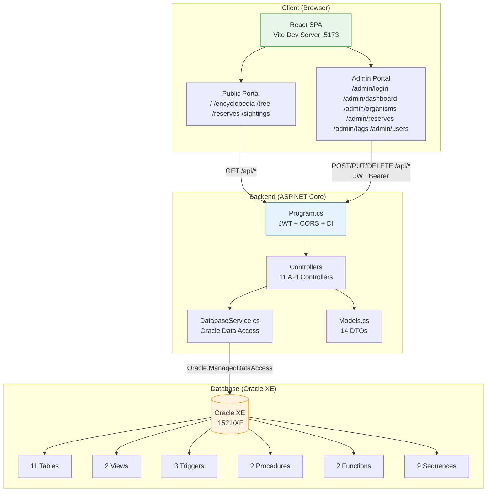
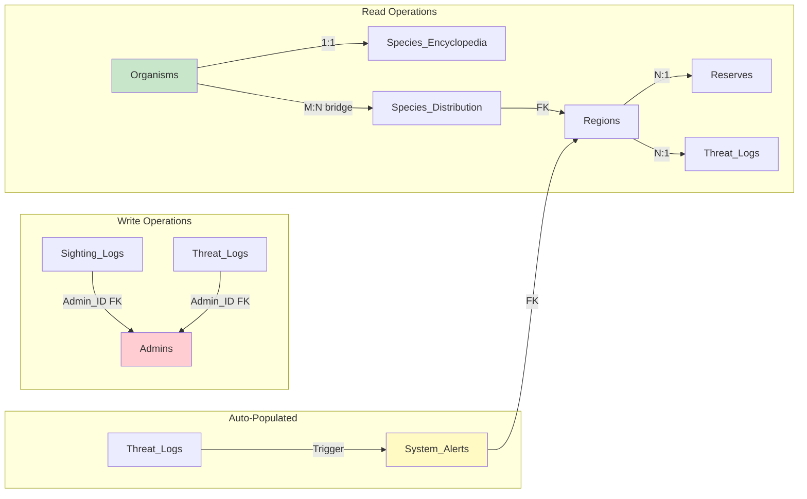
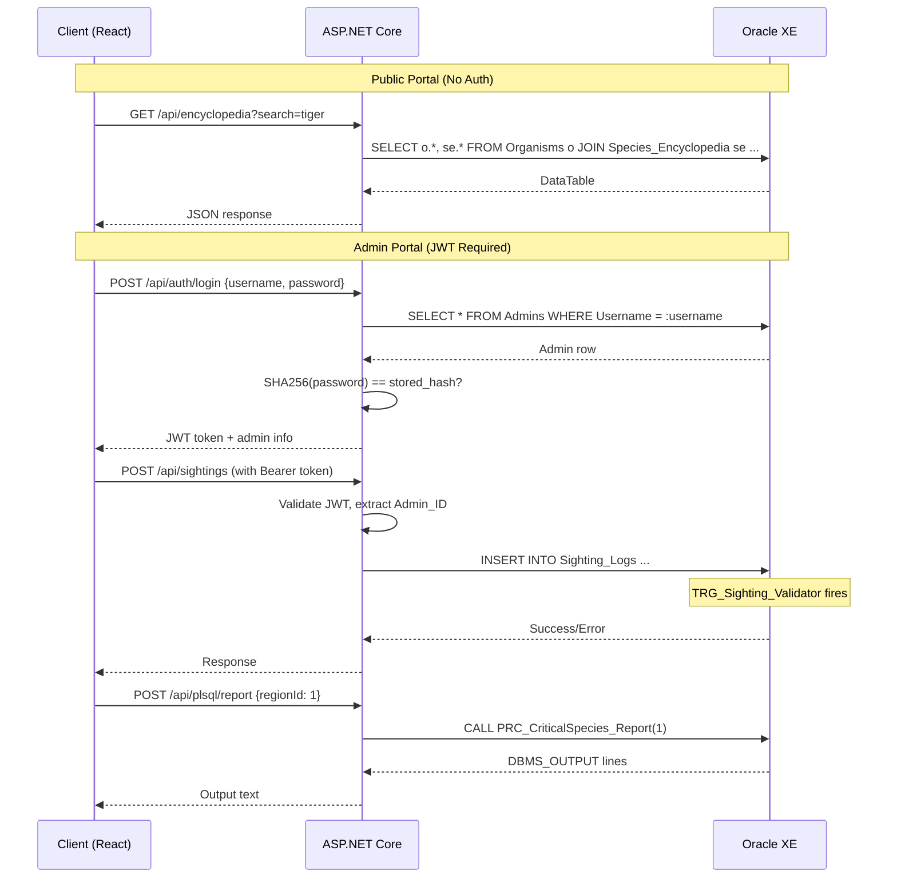
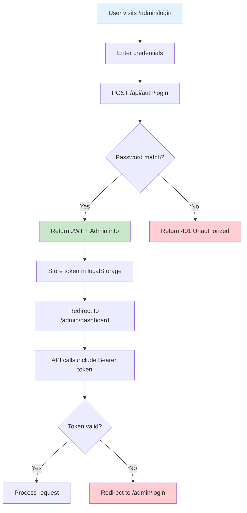

# Bioma — Wildlife & Conservation Management System

A full-stack wildlife conservation management platform with two separate portals: a **public Viewer Portal** (read-only) for browsing species encyclopedia and reserves, and an **Admin Portal** (JWT-protected) for managing organisms, sightings, threats, and conservation data.

---

## Table of Contents

- [Project Overview](#project-overview)
- [Tech Stack](#tech-stack)
- [Project Structure](#project-structure)
- [Architecture Overview](#architecture-overview)
- [Database Schema](#database-schema)
- [ER Diagram](#er-diagram)
- [Schema Diagram](#schema-diagram)
- [Table Relationships](#table-relationships)
- [Views](#views)
- [Triggers](#triggers)
- [Stored Procedures](#stored-procedures)
- [Functions](#functions)
- [Sequences & Auto-ID Triggers](#sequences--auto-id-triggers)
- [Conservation Status Codes](#conservation-status-codes)
- [Taxonomy Ranks](#taxonomy-ranks)
- [Seed Data Summary](#seed-data-summary)
- [Portals & Routing](#portals--routing)
- [Page Specifications](#page-specifications)
- [API Architecture](#api-architecture)
- [Authentication](#authentication)
- [Feature List](#feature-list)
- [User Capabilities](#user-capabilities)
- [Setup & Installation](#setup--installation)
- [Documentation](#documentation)
- [License](#license)

---

## Project Overview

**Bioma** is a two-portal wildlife and conservation management system built as an academic database management project. It demonstrates advanced Oracle PL/SQL concepts including recursive self-joins, triggers, stored procedures, functions, and views, all wrapped in a modern full-stack web application.

### Core Objectives

1. **Public Species Encyclopedia** — A searchable, tag-filtered database of species with full taxonomy, distribution, and conservation data
2. **Conservation Management** — Admin tools for logging sightings, tracking threats, managing reserves, and monitoring species health
3. **PL/SQL Demonstration** — A live panel where stored procedures execute against the Oracle database with real-time DBMS_OUTPUT display
4. **Dual Portal Architecture** — Completely separate public and admin interfaces with no cross-linking

### Key Design Decisions

| Decision | Rationale |
|----------|-----------|
| Recursive self-join on Organisms | Stores entire Kingdom→Species taxonomy in one table using `Parent_ID` |
| CHECK constraints over lookup tables | Conservation status (7 values), rank names, severity levels — no extra tables needed |
| Merged Regions (Biomes + Geo) | Single table instead of two, removing unnecessary joins |
| Tags + Organism_Tags as bridge pair | Only genuine M:N relationship that can't be flattened |
| System_Alerts auto-populated | Trigger-populated table demonstrates AFTER INSERT trigger pattern |

---

## Tech Stack

| Layer | Technology | Version | Purpose |
|-------|-----------|---------|---------|
| **Database** | Oracle XE | — | Primary data store with PL/SQL |
| **ORM/Driver** | Oracle.ManagedDataAccess.Core | 23.4.0 | .NET data access to Oracle |
| **Backend** | ASP.NET Core (C#) | .NET 10 | REST API server |
| **Auth** | JWT (JwtBearer) | 10.0.9 | Stateless admin authentication |
| **Frontend** | React | 19.2 | SPA with two portal layouts |
| **Build Tool** | Vite | 8.1 | Development server + bundler |
| **Routing** | React Router | 7.18 | Client-side navigation |
| **HTTP Client** | Axios | 1.18 | API communication with JWT interceptor |
| **Charts** | Recharts | 3.9 | Dashboard visualizations |
| **Icons** | Lucide React | 1.22 | UI icon library |
| **Linter** | oxlint | 1.69 | Fast JavaScript/TypeScript linting |

### Architecture Diagram



---

## Project Structure

```
DBMS PROJECT/
├── README.md
├── docs/
│   ├── 01_Project_Proposal.md        # Full project proposal with schema rationale
│   ├── 02_Page_Specification.md      # UI/UX route specs for both portals
│   ├── 03_Database_Architecture.md   # Table relationships & ERD
│   ├── 04_User_Capabilities.md       # Public vs Admin capabilities
│   └── 05_Feature_List.md            # 41-point feature checklist
├── images/                            # SVG diagrams & design references
│   ├── main_er_diagram.svg
│   ├── taxonomy_hierarchy.svg
│   ├── species_details.svg
│   ├── sighting_logs.svg
│   ├── organism_tagging.svg
│   ├── biogeographical_distribution.svg
│   ├── ecological_interactions.svg
│   └── threat_monitoring.svg
└── Bioma/
    ├── Bioma.slnx                    # Solution file
    ├── Bioma/                        # Backend (ASP.NET Core)
    │   ├── Program.cs                # App bootstrap (JWT, CORS, DI)
    │   ├── appsettings.json          # DB connection + JWT config
    │   ├── Bioma.csproj              # Project file
    │   ├── setup.sql                 # Full DDL (tables, views, triggers, procedures, functions)
    │   ├── populate.sql              # Organism + Encyclopedia seed data
    │   ├── populate_additional.sql   # Regions, Reserves, Tags, Distributions seed data
    │   ├── assign_tags.sql           # Tag assignment script
    │   ├── update_images.sql         # Image URL update script
    │   ├── Models/
    │   │   └── Models.cs             # 14 C# DTOs
    │   ├── Controllers/
    │   │   ├── AuthController.cs     # Login + Admin CRUD (POST /api/auth/login)
    │   │   ├── DashboardController.cs # Stats, leaderboard, reserve health
    │   │   ├── EncyclopediaController.cs # Species encyclopedia CRUD + search
    │   │   ├── TaxonomyController.cs  # Taxonomy tree + organism CRUD
    │   │   ├── SightingsController.cs # Sighting log CRUD
    │   │   ├── ReservesController.cs  # Reserve CRUD
    │   │   ├── ThreatsController.cs   # Threat log CRUD
    │   │   ├── TagsController.cs      # Tag CRUD + organism-tag assignments
    │   │   ├── DistributionsController.cs # Species distribution CRUD
    │   │   ├── PlSqlController.cs     # Execute PL/SQL procedures, return DBMS_OUTPUT
    │   │   └── SetupController.cs     # Database initialization (run setup.sql)
    │   └── Services/
    │       └── DatabaseService.cs    # Oracle data access layer
    └── ecosystemdb-client/           # Frontend (React + Vite)
        ├── package.json
        ├── vite.config.js
        └── src/
            ├── main.jsx
            ├── App.jsx               # Route definitions
            ├── api.js                # Axios instance with JWT interceptor
            ├── components/
            │   ├── AdminLayout.jsx
            │   └── PublicLayout.jsx
            └── pages/
                ├── Login.jsx
                ├── Dashboard.jsx
                ├── Organisms.jsx
                ├── Reserves.jsx
                ├── Tags.jsx
                ├── Users.jsx
                └── public/
                    ├── Home.jsx
                    ├── Encyclopedia.jsx
                    ├── SpeciesDetail.jsx
                    ├── TaxonomyTree.jsx
                    ├── PublicReserves.jsx
                    ├── PublicSightings.jsx
                    ├── RegionDetail.jsx
                    └── ReserveDetail.jsx
```

---

## Database Schema

### Overview

The database consists of **11 tables** (10 user-defined + 1 auto-populated by trigger), designed for Oracle XE with PL/SQL.

| # | Table | Type | Purpose | Row Count |
|---|-------|------|---------|-----------|
| 1 | **Admins** | Standalone | System administrators (only user table) | 1 |
| 2 | **Organisms** | Recursive hub | Taxonomic hierarchy (recursive self-join) | 160+ |
| 3 | **Species_Encyclopedia** | 1:1 satellite | Public-facing species content | 160+ |
| 4 | **Regions** | Standalone | Geographic regions with biome data | 10 |
| 5 | **Species_Distribution** | M:N bridge | Organisms ↔ Regions with population data | 100+ |
| 6 | **Reserves** | Standalone | Conservation reserves/parks | 20 |
| 7 | **Sighting_Logs** | Transaction | Wildlife observation records | 0 (admin-populated) |
| 8 | **Threat_Logs** | Transaction | Ecological threat records | 0 (admin-populated) |
| 9 | **Tags** | Lookup | Classification tags for organisms | 10 |
| 10 | **Organism_Tags** | M:N bridge | Organisms ↔ Tags | 500+ |
| 11 | **System_Alerts** | Auto-populated | Critical threat alerts (trigger-populated) | 0 (trigger-populated) |

---

### Table: Admins

The only user table. Every row is an admin — no roles, no public registration.

```sql
CREATE TABLE Admins (
    Admin_ID      INT           PRIMARY KEY,
    Username      VARCHAR2(50)  UNIQUE NOT NULL,
    Password_Hash VARCHAR2(255) NOT NULL,
    Full_Name     VARCHAR2(100),
    Email         VARCHAR2(100) UNIQUE,
    Created_At    DATE          DEFAULT SYSDATE
);
```

| Column | Type | Constraints | Description |
|--------|------|-------------|-------------|
| Admin_ID | INT | PK, auto-generated | Unique admin identifier |
| Username | VARCHAR2(50) | UNIQUE, NOT NULL | Login username |
| Password_Hash | VARCHAR2(255) | NOT NULL | SHA-256 Base64 encoded password |
| Full_Name | VARCHAR2(100) | — | Display name |
| Email | VARCHAR2(100) | UNIQUE | Contact email |
| Created_At | DATE | DEFAULT SYSDATE | Account creation date |

**Default admin**: `admin` / `admin123` (SHA-256: `jGl25bVBBBW96Qi9Te4V37Fnqchz/Eu4qB9vKrRIqRg=`)

---

### Table: Organisms

The star table — stores the full taxonomic hierarchy via recursive self-join.

```sql
CREATE TABLE Organisms (
    Organism_ID         INT           PRIMARY KEY,
    Scientific_Name     VARCHAR2(100) UNIQUE NOT NULL,
    Common_Name         VARCHAR2(100),
    Rank_Name           VARCHAR2(50)  CHECK (Rank_Name IN ('Kingdom','Phylum','Class','Order','Family','Genus','Species')),
    Parent_ID           INT,
    Kingdom_Type        VARCHAR2(20)  CHECK (Kingdom_Type IN ('Animal','Plant')),
    Conservation_Status VARCHAR2(10)  CHECK (Conservation_Status IN ('LC','NT','VU','EN','CR','EW','EX')),
    Discovery_Year      INT,
    CONSTRAINT fk_organism_parent FOREIGN KEY (Parent_ID) REFERENCES Organisms(Organism_ID) ON DELETE SET NULL
);
```

| Column | Type | Constraints | Description |
|--------|------|-------------|-------------|
| Organism_ID | INT | PK, auto-generated | Unique organism identifier |
| Scientific_Name | VARCHAR2(100) | UNIQUE, NOT NULL | Latin binomial name |
| Common_Name | VARCHAR2(100) | — | Everyday name |
| Rank_Name | VARCHAR2(50) | CHECK | Taxonomic rank (Kingdom→Species) |
| Parent_ID | INT | FK → self, ON DELETE SET NULL | Parent in taxonomy tree |
| Kingdom_Type | VARCHAR2(20) | CHECK | Animal or Plant |
| Conservation_Status | VARCHAR2(10) | CHECK | IUCN status code |
| Discovery_Year | INT | — | Year species was described |

---

### Table: Species_Encyclopedia

Public-facing content — detailed species profiles. 1:1 with Organisms.

```sql
CREATE TABLE Species_Encyclopedia (
    Encyclopedia_ID          INT           PRIMARY KEY,
    Organism_ID              INT           UNIQUE NOT NULL,
    Description              CLOB,
    Diet_Type                VARCHAR2(20)  CHECK (Diet_Type IN ('Carnivore','Herbivore','Omnivore','Autotroph')),
    Diet_Details             VARCHAR2(255),
    Physical_Description     VARCHAR2(255),
    Avg_Height_Cm            NUMBER(10,2),
    Avg_Length_Cm            NUMBER(10,2),
    Habitat_Behavior         VARCHAR2(255),
    Reproduction_Info        VARCHAR2(255),
    Native_Range_Description VARCHAR2(255),
    Image_URL                VARCHAR2(500),
    Fun_Fact                 VARCHAR2(500),
    Last_Updated             DATE          DEFAULT SYSDATE,
    CONSTRAINT fk_encyclopedia_organism FOREIGN KEY (Organism_ID) REFERENCES Organisms(Organism_ID) ON DELETE CASCADE
);
```

| Column | Type | Constraints | Description |
|--------|------|-------------|-------------|
| Encyclopedia_ID | INT | PK, auto-generated | Unique encyclopedia entry ID |
| Organism_ID | INT | UNIQUE, FK → Organisms, CASCADE | Links to organism (1:1) |
| Description | CLOB | — | Full species description |
| Diet_Type | VARCHAR2(20) | CHECK | Carnivore/Herbivore/Omnivore/Autotroph |
| Diet_Details | VARCHAR2(255) | — | Specific dietary information |
| Physical_Description | VARCHAR2(255) | — | Appearance description |
| Avg_Height_Cm | NUMBER(10,2) | — | Average height in centimeters |
| Avg_Length_Cm | NUMBER(10,2) | — | Average length in centimeters |
| Habitat_Behavior | VARCHAR2(255) | — | Habitat and behavioral notes |
| Reproduction_Info | VARCHAR2(255) | — | Breeding/reproduction details |
| Native_Range_Description | VARCHAR2(255) | — | Geographic range description |
| Image_URL | VARCHAR2(500) | — | URL to species image |
| Fun_Fact | VARCHAR2(500) | — | Interesting fact |
| Last_Updated | DATE | DEFAULT SYSDATE | Last modification timestamp |

---

### Table: Regions

Geographic regions with biome data (merged from Biomes + Geographical_Regions).

```sql
CREATE TABLE Regions (
    Region_ID    INT           PRIMARY KEY,
    Region_Name  VARCHAR2(100) NOT NULL,
    Country      VARCHAR2(100) NOT NULL,
    Biome_Name   VARCHAR2(100),
    Climate_Zone VARCHAR2(100),
    Area_SqKm    NUMBER(15,2),
    Is_Protected CHAR(1)       CHECK (Is_Protected IN ('Y','N'))
);
```

| Column | Type | Constraints | Description |
|--------|------|-------------|-------------|
| Region_ID | INT | PK, auto-generated | Unique region identifier |
| Region_Name | VARCHAR2(100) | NOT NULL | Name of the region |
| Country | VARCHAR2(100) | NOT NULL | Country where region is located |
| Biome_Name | VARCHAR2(100) | — | Ecosystem type (Rainforest, Desert, etc.) |
| Climate_Zone | VARCHAR2(100) | — | Climate classification |
| Area_SqKm | NUMBER(15,2) | — | Total area in square kilometers |
| Is_Protected | CHAR(1) | CHECK | Y = protected area, N = unprotected |

---

### Table: Species_Distribution

Many-to-many bridge between Organisms and Regions with population data.

```sql
CREATE TABLE Species_Distribution (
    Organism_ID          INT,
    Region_ID            INT,
    Estimated_Population INT CHECK (Estimated_Population >= 0),
    Last_Survey_Date     DATE,
    Population_Trend     VARCHAR2(20) CHECK (Population_Trend IN ('Increasing','Stable','Decreasing','Unknown')),
    PRIMARY KEY (Organism_ID, Region_ID),
    CONSTRAINT fk_dist_organism FOREIGN KEY (Organism_ID) REFERENCES Organisms(Organism_ID) ON DELETE CASCADE,
    CONSTRAINT fk_dist_region   FOREIGN KEY (Region_ID)   REFERENCES Regions(Region_ID) ON DELETE CASCADE
);
```

| Column | Type | Constraints | Description |
|--------|------|-------------|-------------|
| Organism_ID | INT | CPK, FK → Organisms, CASCADE | Species reference |
| Region_ID | INT | CPK, FK → Regions, CASCADE | Region reference |
| Estimated_Population | INT | CHECK ≥ 0 | Population count in this region |
| Last_Survey_Date | DATE | — | When population was last surveyed |
| Population_Trend | VARCHAR2(20) | CHECK | Increasing/Stable/Decreasing/Unknown |

---

### Table: Reserves

Conservation reserves and protected areas.

```sql
CREATE TABLE Reserves (
    Reserve_ID       INT           PRIMARY KEY,
    Reserve_Name     VARCHAR2(100) NOT NULL,
    Region_ID        INT,
    Total_Area_SqKm  NUMBER(15,2)  CHECK (Total_Area_SqKm > 0),
    Annual_Budget_USD NUMBER(15,2) CHECK (Annual_Budget_USD >= 0),
    Established_Year INT,
    Reserve_Type     VARCHAR2(100),
    CONSTRAINT fk_reserve_region FOREIGN KEY (Region_ID) REFERENCES Regions(Region_ID) ON DELETE SET NULL
);
```

| Column | Type | Constraints | Description |
|--------|------|-------------|-------------|
| Reserve_ID | INT | PK, auto-generated | Unique reserve identifier |
| Reserve_Name | VARCHAR2(100) | NOT NULL | Name of the reserve |
| Region_ID | INT | FK → Regions, ON DELETE SET NULL | Geographic region |
| Total_Area_SqKm | NUMBER(15,2) | CHECK > 0 | Reserve area in km² |
| Annual_Budget_USD | NUMBER(15,2) | CHECK ≥ 0 | Annual operating budget |
| Established_Year | INT | — | Year reserve was established |
| Reserve_Type | VARCHAR2(100) | — | National Park / Wildlife Sanctuary / Marine Reserve |

---

### Table: Sighting_Logs

High-frequency transaction table for wildlife observation records.

```sql
CREATE TABLE Sighting_Logs (
    Sighting_ID       INT       PRIMARY KEY,
    Organism_ID       INT,
    Reserve_ID        INT,
    Admin_ID          INT,
    Sighting_Timestamp TIMESTAMP DEFAULT SYSTIMESTAMP,
    Quantity_Observed INT       NOT NULL,
    Health_Status     VARCHAR2(50) CHECK (Health_Status IN ('Healthy','Injured','Malnourished','Dead','Unknown')),
    Observation_Notes VARCHAR2(500),
    CONSTRAINT fk_sighting_organism FOREIGN KEY (Organism_ID) REFERENCES Organisms(Organism_ID) ON DELETE CASCADE,
    CONSTRAINT fk_sighting_reserve  FOREIGN KEY (Reserve_ID)  REFERENCES Reserves(Reserve_ID) ON DELETE CASCADE,
    CONSTRAINT fk_sighting_admin    FOREIGN KEY (Admin_ID)    REFERENCES Admins(Admin_ID) ON DELETE SET NULL
);
```

| Column | Type | Constraints | Description |
|--------|------|-------------|-------------|
| Sighting_ID | INT | PK, auto-generated | Unique sighting record |
| Organism_ID | INT | FK → Organisms, CASCADE | Species observed |
| Reserve_ID | INT | FK → Reserves, CASCADE | Location of observation |
| Admin_ID | INT | FK → Admins, SET NULL | Who logged the sighting |
| Sighting_Timestamp | TIMESTAMP | DEFAULT SYSTIMESTAMP | When observation occurred |
| Quantity_Observed | INT | NOT NULL | Number of individuals seen |
| Health_Status | VARCHAR2(50) | CHECK | Condition of observed animals |
| Observation_Notes | VARCHAR2(500) | — | Free-text field notes |

---

### Table: Threat_Logs

Ecological threat records linked to regions.

```sql
CREATE TABLE Threat_Logs (
    Log_ID            INT           PRIMARY KEY,
    Region_ID         INT,
    Threat_Name       VARCHAR2(100) NOT NULL,
    Threat_Category   VARCHAR2(100) CHECK (Threat_Category IN ('Human-Caused','Natural','Climate-Related')),
    Severity_Level    VARCHAR2(20)  CHECK (Severity_Level IN ('Low','Medium','High','Critical')),
    Assessment_Date   DATE          NOT NULL,
    Admin_ID          INT,
    Resolution_Status VARCHAR2(20)  DEFAULT 'Active' CHECK (Resolution_Status IN ('Active','Monitoring','Resolved')),
    CONSTRAINT fk_threat_region FOREIGN KEY (Region_ID) REFERENCES Regions(Region_ID) ON DELETE CASCADE,
    CONSTRAINT fk_threat_admin  FOREIGN KEY (Admin_ID)  REFERENCES Admins(Admin_ID) ON DELETE SET NULL
);
```

| Column | Type | Constraints | Description |
|--------|------|-------------|-------------|
| Log_ID | INT | PK, auto-generated | Unique threat record |
| Region_ID | INT | FK → Regions, CASCADE | Affected region |
| Threat_Name | VARCHAR2(100) | NOT NULL | Name of the threat |
| Threat_Category | VARCHAR2(100) | CHECK | Human-Caused/Natural/Climate-Related |
| Severity_Level | VARCHAR2(20) | CHECK | Low/Medium/High/Critical |
| Assessment_Date | DATE | NOT NULL | Date threat was assessed |
| Admin_ID | INT | FK → Admins, SET NULL | Who reported the threat |
| Resolution_Status | VARCHAR2(20) | DEFAULT 'Active', CHECK | Active/Monitoring/Resolved |

---

### Table: Tags

Classification tags for organisms.

```sql
CREATE TABLE Tags (
    Tag_ID       INT          PRIMARY KEY,
    Tag_Name     VARCHAR2(50) UNIQUE NOT NULL,
    Tag_Category VARCHAR2(50),
    Tag_Color    VARCHAR2(20)
);
```

| Column | Type | Constraints | Description |
|--------|------|-------------|-------------|
| Tag_ID | INT | PK, auto-generated | Unique tag identifier |
| Tag_Name | VARCHAR2(50) | UNIQUE, NOT NULL | Tag label |
| Tag_Category | VARCHAR2(50) | — | Category group (Conservation, Danger, Behavior, etc.) |
| Tag_Color | VARCHAR2(20) | — | Display color |

**Predefined tags**: Endangered, Venomous, Migratory, Nocturnal, Edible, Invasive, Apex Predator, Pollinator, Medicinal, Pet Trade

---

### Table: Organism_Tags

Many-to-many bridge between Organisms and Tags.

```sql
CREATE TABLE Organism_Tags (
    Organism_ID INT,
    Tag_ID      INT,
    PRIMARY KEY (Organism_ID, Tag_ID),
    CONSTRAINT fk_otag_organism FOREIGN KEY (Organism_ID) REFERENCES Organisms(Organism_ID) ON DELETE CASCADE,
    CONSTRAINT fk_otag_tag      FOREIGN KEY (Tag_ID)      REFERENCES Tags(Tag_ID) ON DELETE CASCADE
);
```

| Column | Type | Constraints | Description |
|--------|------|-------------|-------------|
| Organism_ID | INT | CPK, FK → Organisms, CASCADE | Species reference |
| Tag_ID | INT | CPK, FK → Tags, CASCADE | Tag reference |

---

### Table: System_Alerts

Auto-populated by `TRG_CriticalThreat_Alert` trigger. Never written directly by the application.

```sql
CREATE TABLE System_Alerts (
    Alert_ID      INT           PRIMARY KEY,
    Alert_Type    VARCHAR2(50)  NOT NULL,
    Alert_Message VARCHAR2(500) NOT NULL,
    Region_ID     INT,
    Threat_Log_ID INT,
    Created_At    TIMESTAMP     DEFAULT SYSTIMESTAMP,
    CONSTRAINT fk_alert_region FOREIGN KEY (Region_ID)   REFERENCES Regions(Region_ID) ON DELETE SET NULL,
    CONSTRAINT fk_alert_threat FOREIGN KEY (Threat_Log_ID) REFERENCES Threat_Logs(Log_ID) ON DELETE SET NULL
);
```

| Column | Type | Constraints | Description |
|--------|------|-------------|-------------|
| Alert_ID | INT | PK, auto-generated | Unique alert identifier |
| Alert_Type | VARCHAR2(50) | NOT NULL | Type of alert (e.g., CRITICAL_THREAT) |
| Alert_Message | VARCHAR2(500) | NOT NULL | Descriptive alert message |
| Region_ID | INT | FK → Regions, SET NULL | Affected region |
| Threat_Log_ID | INT | FK → Threat_Logs, SET NULL | Source threat record |
| Created_At | TIMESTAMP | DEFAULT SYSTIMESTAMP | When alert was generated |

---

## ER Diagram

```mermaid
erDiagram
    Admins {
        int Admin_ID PK
        varchar Username UK
        varchar Password_Hash
        varchar Full_Name
        varchar Email UK
        date Created_At
    }

    Organisms {
        int Organism_ID PK
        varchar Scientific_Name UK
        varchar Common_Name
        varchar Rank_Name
        int Parent_ID FK
        varchar Kingdom_Type
        varchar Conservation_Status
        int Discovery_Year
    }

    Species_Encyclopedia {
        int Encyclopedia_ID PK
        int Organism_ID FK "UK"
        clob Description
        varchar Diet_Type
        varchar Diet_Details
        varchar Physical_Description
        float Avg_Height_Cm
        float Avg_Length_Cm
        varchar Habitat_Behavior
        varchar Reproduction_Info
        varchar Native_Range_Description
        varchar Image_URL
        varchar Fun_Fact
        date Last_Updated
    }

    Regions {
        int Region_ID PK
        varchar Region_Name
        varchar Country
        varchar Biome_Name
        varchar Climate_Zone
        float Area_SqKm
        char Is_Protected
    }

    Species_Distribution {
        int Organism_ID PK FK
        int Region_ID PK FK
        int Estimated_Population
        date Last_Survey_Date
        varchar Population_Trend
    }

    Reserves {
        int Reserve_ID PK
        varchar Reserve_Name
        int Region_ID FK
        float Total_Area_SqKm
        float Annual_Budget_USD
        int Established_Year
        varchar Reserve_Type
    }

    Sighting_Logs {
        int Sighting_ID PK
        int Organism_ID FK
        int Reserve_ID FK
        int Admin_ID FK
        timestamp Sighting_Timestamp
        int Quantity_Observed
        varchar Health_Status
        varchar Observation_Notes
    }

    Threat_Logs {
        int Log_ID PK
        int Region_ID FK
        varchar Threat_Name
        varchar Threat_Category
        varchar Severity_Level
        date Assessment_Date
        int Admin_ID FK
        varchar Resolution_Status
    }

    Tags {
        int Tag_ID PK
        varchar Tag_Name UK
        varchar Tag_Category
        varchar Tag_Color
    }

    Organism_Tags {
        int Organism_ID PK FK
        int Tag_ID PK FK
    }

    System_Alerts {
        int Alert_ID PK
        varchar Alert_Type
        varchar Alert_Message
        int Region_ID FK
        int Threat_Log_ID FK
        timestamp Created_At
    }

    Admins ||--o{ Sighting_Logs : "Logs"
    Admins ||--o{ Threat_Logs : "Reports"

    Organisms ||--o{ Organisms : "Parent_ID (Recursive)"
    Organisms ||--|| Species_Encyclopedia : "Described by"
    Organisms ||--o{ Sighting_Logs : "Sighted in"

    Organisms ||--o{ Species_Distribution : "Has distribution"
    Regions ||--o{ Species_Distribution : "Contains species"

    Organisms ||--o{ Organism_Tags : "Has tags"
    Tags ||--o{ Organism_Tags : "Applied to species"

    Regions ||--o{ Reserves : "Contains"
    Regions ||--o{ Threat_Logs : "Faces threats"

    Reserves ||--o{ Sighting_Logs : "Occurs at"

    Regions ||--o{ System_Alerts : "Alerted about"
    Threat_Logs ||--o{ System_Alerts : "Triggers alert"
```

---

## Schema Diagram

```
┌─────────────────────┐          ┌──────────────────────┐
│      Admins         │          │     Organisms        │
├─────────────────────┤          ├──────────────────────┤
│ Admin_ID      [PK]  │          │ Organism_ID    [PK]  │
│ Username      [UK]  │◄────┐    │ Scientific_Name[UK]  │
│ Password_Hash       │     │    │ Common_Name          │
│ Full_Name           │     │    │ Rank_Name    [CHECK] │
│ Email         [UK]  │     │    │ Parent_ID     [FK]───┤──┐
│ Created_At          │     │    │ Kingdom_Type  [CHECK] │  │
└─────────┬───────────┘     │    │ Conservation_Status   │  │
          │                 │    │ Discovery_Year        │  │
          │                 │    └──────────┬────────────┘  │
          │                 │               │               │
          │                 │               │               │
          │    ┌────────────┘               │               │
          │    │                            │               │
          │    │    ┌───────────────────────┤               │
          │    │    │                       │               │
          ▼    ▼    ▼                       ▼               │
┌──────────────────────────┐    ┌─────────────────────────┐│
│     Sighting_Logs        │    │  Species_Encyclopedia   ││
├──────────────────────────┤    ├─────────────────────────┤│
│ Sighting_ID        [PK]  │    │ Encyclopedia_ID    [PK] ││
│ Organism_ID        [FK]──┤    │ Organism_ID        [UK]─┤┘
│ Reserve_ID         [FK]──┤    │ Description       [CLOB]│
│ Admin_ID           [FK]──┘    │ Diet_Type        [CHECK]│
│ Sighting_Timestamp        │    │ Diet_Details             │
│ Quantity_Observed         │    │ Physical_Description     │
│ Health_Status    [CHECK]  │    │ Avg_Height_Cm           │
│ Observation_Notes         │    │ Avg_Length_Cm            │
└──────────┬───────────────┘    │ Habitat_Behavior         │
           │                    │ Reproduction_Info        │
           │                    │ Native_Range_Description │
           │                    │ Image_URL                │
           │                    │ Fun_Fact                 │
           │                    │ Last_Updated             │
           │                    └─────────────────────────┘
           │
           ▼
┌──────────────────────┐     ┌──────────────────────┐
│     Reserves         │     │      Regions          │
├──────────────────────┤     ├──────────────────────┤
│ Reserve_ID     [PK]  │     │ Region_ID       [PK] │
│ Reserve_Name         │     │ Region_Name          │
│ Region_ID      [FK]──┤◄────│ Country              │
│ Total_Area_SqKm      │     │ Biome_Name           │
│ Annual_Budget_USD    │     │ Climate_Zone         │
│ Established_Year     │     │ Area_SqKm            │
│ Reserve_Type         │     │ Is_Protected  [CHECK]│
└──────────────────────┘     └───────┬──────────────┘
                                     │
              ┌──────────────────────┼──────────────────┐
              │                      │                  │
              ▼                      ▼                  ▼
┌─────────────────────────┐ ┌──────────────────┐ ┌──────────────────┐
│ Species_Distribution    │ │  Threat_Logs     │ │  System_Alerts   │
├─────────────────────────┤ ├──────────────────┤ ├──────────────────┤
│ Organism_ID [CPK,FK]    │ │ Log_ID     [PK]  │ │ Alert_ID   [PK]  │
│ Region_ID   [CPK,FK]    │ │ Region_ID  [FK]  │ │ Alert_Type       │
│ Estimated_Population    │ │ Threat_Name      │ │ Alert_Message    │
│ Last_Survey_Date        │ │ Threat_Category  │ │ Region_ID  [FK]  │
│ Population_Trend[CHECK] │ │ Severity_Level   │ │ Threat_Log_ID[FK]│
└─────────────────────────┘ │ Assessment_Date  │ │ Created_At       │
                            │ Admin_ID    [FK] │ └──────────────────┘
                            │ Resolution_Status│
                            └──────────────────┘

┌──────────────────────┐     ┌──────────────────────┐
│       Tags           │     │   Organism_Tags      │
├──────────────────────┤     ├──────────────────────┤
│ Tag_ID         [PK]  │     │ Organism_ID [CPK,FK] │
│ Tag_Name       [UK]  │◄────│ Tag_ID      [CPK,FK] │
│ Tag_Category         │     └──────────────────────┘
│ Tag_Color            │
└──────────────────────┘
```

---

## Table Relationships

```
Admins ─────────────┬──────────── Sighting_Logs ──────────── Organisms
                    │                       │                      │
                    │                       │                      ├── Species_Encyclopedia (1:1)
                    │                       │                      │
                    │                       │                      ├── Organism_Tags ──── Tags
                    │                       │                      │
                    │                       │                      └── Species_Distribution ──── Regions
                    │                       │
                    └──────────── Threat_Logs ────────────── Regions ──── Reserves ──── Sighting_Logs
                                           │
                                           └── System_Alerts (auto-populated)

Organisms ──(recursive)── Organisms  (Parent_ID self-join for taxonomy tree)
```

### Relationship Summary

| Relationship | Type | FK Column | On Delete |
|-------------|------|-----------|-----------|
| Organisms → Organisms | Self-referencing | Parent_ID | SET NULL |
| Species_Encyclopedia → Organisms | 1:1 | Organism_ID | CASCADE |
| Species_Distribution → Organisms | M:N bridge | Organism_ID | CASCADE |
| Species_Distribution → Regions | M:N bridge | Region_ID | CASCADE |
| Reserves → Regions | N:1 | Region_ID | SET NULL |
| Sighting_Logs → Organisms | N:1 | Organism_ID | CASCADE |
| Sighting_Logs → Reserves | N:1 | Reserve_ID | CASCADE |
| Sighting_Logs → Admins | N:1 | Admin_ID | SET NULL |
| Threat_Logs → Regions | N:1 | Region_ID | CASCADE |
| Threat_Logs → Admins | N:1 | Admin_ID | SET NULL |
| Organism_Tags → Organisms | M:N bridge | Organism_ID | CASCADE |
| Organism_Tags → Tags | M:N bridge | Tag_ID | CASCADE |
| System_Alerts → Regions | N:1 | Region_ID | SET NULL |
| System_Alerts → Threat_Logs | N:1 | Threat_Log_ID | SET NULL |

### Communication Patterns



---

## Views

### V_ExtinctionRisk

Ranks species by conservation status and global population across all regions.

```sql
CREATE OR REPLACE VIEW V_ExtinctionRisk AS
SELECT
    o.Organism_ID,
    o.Scientific_Name,
    o.Common_Name,
    o.Conservation_Status,
    NVL(SUM(sd.Estimated_Population), 0) AS Global_Population,
    COUNT(sd.Region_ID) AS Region_Count
FROM Organisms o
LEFT JOIN Species_Distribution sd ON o.Organism_ID = sd.Organism_ID
WHERE o.Rank_Name = 'Species'
GROUP BY o.Organism_ID, o.Scientific_Name, o.Common_Name, o.Conservation_Status;
```

### V_Reserve_Health

Shows reserve health metrics: total sightings, unique species spotted, and unhealthy sighting counts.

```sql
CREATE OR REPLACE VIEW V_Reserve_Health AS
SELECT
    r.Reserve_ID,
    r.Reserve_Name,
    r.Total_Area_SqKm,
    r.Annual_Budget_USD,
    reg.Region_Name,
    COUNT(s.Sighting_ID) AS Total_Sightings,
    COUNT(DISTINCT s.Organism_ID) AS Unique_Species_Spotted,
    SUM(CASE WHEN s.Health_Status IN ('Injured','Malnourished','Dead') THEN 1 ELSE 0 END) AS Unhealthy_Sightings
FROM Reserves r
JOIN Regions reg ON r.Region_ID = reg.Region_ID
LEFT JOIN Sighting_Logs s ON r.Reserve_ID = s.Reserve_ID
GROUP BY r.Reserve_ID, r.Reserve_Name, r.Total_Area_SqKm, r.Annual_Budget_USD, reg.Region_Name;
```

---

## Triggers

### TRG_Sighting_Validator

Fires **BEFORE INSERT OR UPDATE** on `Sighting_Logs`. Validates data integrity.

```sql
CREATE OR REPLACE TRIGGER TRG_Sighting_Validator
BEFORE INSERT OR UPDATE ON Sighting_Logs
FOR EACH ROW
BEGIN
    IF :NEW.Quantity_Observed <= 0 THEN
        RAISE_APPLICATION_ERROR(-20001, 'Quantity observed must be greater than zero.');
    END IF;
    IF :NEW.Health_Status IS NULL THEN
        RAISE_APPLICATION_ERROR(-20002, 'Health status cannot be null.');
    END IF;
END;
```

- Blocks quantity ≤ 0
- Blocks null health status

### TRG_AutoExtinction_Escalator

Fires **AFTER UPDATE** on `Species_Distribution`. Automatically escalates conservation status when a species reaches zero population globally.

```sql
CREATE OR REPLACE TRIGGER TRG_AutoExtinction_Escalator
AFTER UPDATE ON Species_Distribution
FOR EACH ROW
WHEN (NEW.Estimated_Population = 0 AND OLD.Estimated_Population > 0)
DECLARE
    PRAGMA AUTONOMOUS_TRANSACTION;
    v_total_pop INT;
BEGIN
    SELECT NVL(SUM(Estimated_Population), 0) INTO v_total_pop
    FROM Species_Distribution WHERE Organism_ID = :NEW.Organism_ID;

    IF v_total_pop = 0 THEN
        UPDATE Organisms
        SET Conservation_Status = 'EW'
        WHERE Organism_ID = :NEW.Organism_ID
        AND Conservation_Status NOT IN ('EW', 'EX');
        COMMIT;
    END IF;
END;
```

- Checks if global population hits zero
- Sets Conservation_Status to 'EW' (Extinct in Wild)

### TRG_CriticalThreat_Alert

Fires **AFTER INSERT** on `Threat_Logs`. Auto-generates system alerts for critical threats.

```sql
CREATE OR REPLACE TRIGGER TRG_CriticalThreat_Alert
AFTER INSERT ON Threat_Logs
FOR EACH ROW
WHEN (NEW.Severity_Level = 'Critical')
DECLARE
    PRAGMA AUTONOMOUS_TRANSACTION;
BEGIN
    INSERT INTO System_Alerts (Alert_Type, Alert_Message, Region_ID, Threat_Log_ID, Created_At)
    VALUES ('CRITICAL_THREAT', :NEW.Threat_Name || ' in Region ' || :NEW.Region_ID,
            :NEW.Region_ID, :NEW.Log_ID, SYSDATE);
    COMMIT;
END;
```

- Only fires when Severity_Level = 'Critical'
- Inserts into System_Alerts table

---

## Stored Procedures

### PRC_CriticalSpecies_Report

Generates a report of endangered and critical species in a given region.

```sql
CREATE OR REPLACE PROCEDURE PRC_CriticalSpecies_Report(p_Region_ID INT)
IS
    CURSOR c_species IS
        SELECT o.Scientific_Name, o.Common_Name, o.Conservation_Status, sd.Estimated_Population
        FROM Organisms o
        JOIN Species_Distribution sd ON o.Organism_ID = sd.Organism_ID
        WHERE sd.Region_ID = p_Region_ID
          AND o.Conservation_Status IN ('EN', 'CR', 'EW');
    v_found BOOLEAN := FALSE;
BEGIN
    DBMS_OUTPUT.PUT_LINE('--- Critical Species Report for Region ' || p_Region_ID || ' ---');
    FOR r_species IN c_species LOOP
        v_found := TRUE;
        DBMS_OUTPUT.PUT_LINE('Species: ' || r_species.Common_Name || ' (' || r_species.Scientific_Name
            || ') - Status: ' || r_species.Conservation_Status
            || ' - Pop: ' || r_species.Estimated_Population);
    END LOOP;
    IF NOT v_found THEN
        DBMS_OUTPUT.PUT_LINE('No critical species found in this region.');
    END IF;
END;
```

### PRC_AllocateGrant

Distributes a grant amount proportionally across reserves based on their area.

```sql
CREATE OR REPLACE PROCEDURE PRC_AllocateGrant(p_Amount NUMBER)
IS
    v_total_area NUMBER;
    CURSOR c_reserves IS SELECT Reserve_ID, Total_Area_SqKm FROM Reserves WHERE Total_Area_SqKm > 0;
BEGIN
    SELECT SUM(Total_Area_SqKm) INTO v_total_area FROM Reserves WHERE Total_Area_SqKm > 0;
    IF v_total_area > 0 THEN
        FOR r_res IN c_reserves LOOP
            UPDATE Reserves
            SET Annual_Budget_USD = NVL(Annual_Budget_USD, 0) + (p_Amount * (r_res.Total_Area_SqKm / v_total_area))
            WHERE Reserve_ID = r_res.Reserve_ID;
        END LOOP;
        COMMIT;
    END IF;
END;
```

---

## Functions

### FN_PopulationDensity

Returns population per km² for a given organism in a given region.

```sql
CREATE OR REPLACE FUNCTION FN_PopulationDensity(p_Organism_ID INT, p_Region_ID INT) RETURN NUMBER
IS
    v_pop INT;
    v_area NUMBER;
BEGIN
    SELECT Estimated_Population INTO v_pop
    FROM Species_Distribution WHERE Organism_ID = p_Organism_ID AND Region_ID = p_Region_ID;
    SELECT Area_SqKm INTO v_area FROM Regions WHERE Region_ID = p_Region_ID;
    IF v_area > 0 THEN RETURN v_pop / v_area;
    ELSE RETURN 0; END IF;
EXCEPTION WHEN NO_DATA_FOUND THEN RETURN 0;
END;
```

### FN_RegionThreatScore

Returns a weighted threat severity score for a region (Low=1, Medium=3, High=5, Critical=10).

```sql
CREATE OR REPLACE FUNCTION FN_RegionThreatScore(p_Region_ID INT) RETURN NUMBER
IS
    v_score NUMBER := 0;
BEGIN
    SELECT NVL(SUM(
        CASE Severity_Level
            WHEN 'Low' THEN 1 WHEN 'Medium' THEN 3
            WHEN 'High' THEN 5 WHEN 'Critical' THEN 10 ELSE 0
        END
    ), 0) INTO v_score
    FROM Threat_Logs WHERE Region_ID = p_Region_ID AND Resolution_Status = 'Active';
    RETURN v_score;
END;
```

---

## Sequences & Auto-ID Triggers

9 sequences with matching BEFORE INSERT triggers that auto-generate IDs when NULL:

| Sequence | Table | Trigger |
|----------|-------|---------|
| Admins_SEQ | Admins | trg_Admins_ID |
| Organisms_SEQ | Organisms | trg_Organisms_ID |
| Encyclopedia_SEQ | Species_Encyclopedia | trg_Encyclopedia_ID |
| Regions_SEQ | Regions | trg_Regions_ID |
| Reserves_SEQ | Reserves | trg_Reserves_ID |
| Sightings_SEQ | Sighting_Logs | trg_Sighting_Logs_ID |
| ThreatLogs_SEQ | Threat_Logs | trg_Threat_Logs_ID |
| Tags_SEQ | Tags | trg_Tags_ID |
| Alerts_SEQ | System_Alerts | trg_Alerts_ID |

### Trigger Pattern

```sql
CREATE OR REPLACE TRIGGER trg_<Table>_ID
BEFORE INSERT ON <Table>
FOR EACH ROW
BEGIN
  IF :NEW.<ID_Column> IS NULL THEN
    SELECT <Sequence>.NEXTVAL INTO :NEW.<ID_Column> FROM DUAL;
  END IF;
END;
```

---

## Conservation Status Codes

Based on IUCN Red List categories:

| Code | Full Name | Description | Risk Level |
|------|-----------|-------------|------------|
| **LC** | Least Concern | Widespread and abundant | 1 (Lowest) |
| **NT** | Near Threatened | Close to qualifying for a threatened category | 2 |
| **VU** | Vulnerable | High risk of extinction in the wild | 3 |
| **EN** | Endangered | Very high risk of extinction in the wild | 4 |
| **CR** | Critically Endangered | Extremely high risk of extinction in the wild | 5 |
| **EW** | Extinct in Wild | Known only to survive in cultivation/captivity | 6 |
| **EX** | Extinct | No known living individuals | 7 (Highest) |

---

## Taxonomy Ranks

The Organisms table uses a recursive self-join to model the biological classification hierarchy:

```
Kingdom (e.g., Animalia)
  └── Phylum (e.g., Chordata)
        └── Class (e.g., Mammalia)
              └── Order
                    └── Family
                          └── Genus
                                └── Species
```

Each level's `Parent_ID` points to the rank above it. The `Rank_Name` column stores which level each organism represents.

### Recursive Query Example

```sql
-- Oracle hierarchical query to get taxonomy lineage
SELECT Organism_ID, Scientific_Name, Common_Name, Rank_Name
FROM Organisms
START WITH Organism_ID = :species_id
CONNECT BY PRIOR Parent_ID = Organism_ID
ORDER BY CASE Rank_Name
    WHEN 'Kingdom' THEN 1 WHEN 'Phylum' THEN 2 WHEN 'Class' THEN 3
    WHEN 'Order' THEN 4 WHEN 'Family' THEN 5 WHEN 'Genus' THEN 6
    WHEN 'Species' THEN 7 END ASC;
```

---

## Seed Data Summary

| Table | Record Count | Notes |
|-------|-------------|-------|
| Admins | 1 | Default admin (admin/admin123) |
| Organisms | 160+ | 10 species x 3 regions (Africa, Asia, Europe) + base taxonomy (Animalia, Chordata, Mammalia) |
| Species_Encyclopedia | 160+ | Full encyclopedia entries for each organism |
| Regions | 10 | African Savanna, Amazon Rainforest, Sahara Desert, Siberian Tundra, Great Barrier Reef, Rocky Mountains, Gobi Desert, Congo Basin, Antarctic Ice Sheet, European Alps |
| Reserves | 20 | 2 reserves per region |
| Tags | 10 | Endangered, Venomous, Migratory, Nocturnal, Edible, Invasive, Apex Predator, Pollinator, Medicinal, Pet Trade |
| Organism_Tags | 500+ | Multiple tags per organism |
| Species_Distribution | 100+ | Species-region population data |
| Sighting_Logs | 0 | Populated via admin actions |
| Threat_Logs | 0 | Populated via admin actions |
| System_Alerts | 0 | Auto-populated by trigger |

### Regions Seeded

| Region | Country | Biome |
|--------|---------|-------|
| African Savanna | Kenya | Grassland |
| Amazon Rainforest | Brazil | Tropical Rainforest |
| Sahara Desert | Morocco | Desert |
| Siberian Tundra | Russia | Tundra |
| Great Barrier Reef | Australia | Marine/Coral Reef |
| Rocky Mountains | USA | Mountain |
| Gobi Desert | Mongolia | Desert |
| Congo Basin | DRC | Tropical Rainforest |
| Antarctic Ice Sheet | Antarctica | Polar Ice |
| European Alps | Switzerland | Mountain |

---

## Portals & Routing

### Public Viewer Portal (No Login Required)

| Route | Page | Description |
|-------|------|-------------|
| `/` | Home | Stats banner, featured species |
| `/encyclopedia` | Encyclopedia | Search + tag-filtered species cards |
| `/encyclopedia/:id` | Species Detail | Full species profile, taxonomy breadcrumbs, distribution |
| `/tree` | Taxonomy Tree | Expandable Kingdom → Species tree browser |
| `/reserves` | Public Reserves | Reserve listings |
| `/reserves/:id` | Reserve Detail | Individual reserve with sighting stats |
| `/regions/:id` | Region Detail | Region info with reserves and species |
| `/sightings` | Public Sightings | Recent sighting logs (read-only) |

### Admin Portal (JWT Protected)

| Route | Page | Description |
|-------|------|-------------|
| `/admin/login` | Login | Admin authentication entry point |
| `/admin/dashboard` | Dashboard | Stat cards, conservation pie chart, extinction leaderboard, PL/SQL panel |
| `/admin/organisms` | Organisms | CRUD on organisms + encyclopedia, sighting log submission |
| `/admin/reserves` | Reserves | CRUD on reserves, threat management, reserve health view |
| `/admin/tags` | Tags | Create/delete tags, assign to organisms |
| `/admin/users` | Users | Admin account management |

---

## Page Specifications

### Public Pages

| Page | Layout | Key Components |
|------|--------|---------------|
| **Home** | Full-width hero, 4-col stat cards, 3-col species grid | Search bar, stat banner, featured species, footer |
| **Encyclopedia** | Search bar, tag filter bar, card grid | Live search, tag pills, status dropdown, result count |
| **Species Detail** | Hero block, quick-facts row, tabbed content | Image, taxonomy breadcrumb, distribution table, tags |
| **Taxonomy Tree** | Single centered column | Expandable tree with rank badges |
| **Public Reserves** | Card grid | Reserve cards with stats |
| **Public Sightings** | Table view | Recent sightings with species and reserve info |

### Admin Pages

| Page | Layout | Key Components |
|------|--------|---------------|
| **Login** | Centered card, no nav | Username/password form |
| **Dashboard** | Sidebar + main content | Stat cards, pie chart, bar chart, reserve health table, PL/SQL terminal |
| **Organisms** | Sidebar + data table | CRUD table, add/edit modals, sighting form |
| **Reserves** | Sidebar + tabbed layout | Reserves tab, Threats tab, health view |
| **Tags** | Sidebar + two-panel | Tag list, assignment interface |
| **Users** | Sidebar + table | Admin account management |

---

## API Architecture

- **Base URL**: `/api` (proxied via Vite in development)
- **Auth**: JWT Bearer token in `Authorization` header
- **Token Storage**: `localStorage` key `bioma_admin_token`
- **OpenAPI**: Available at `/openapi` in Development mode

### Controller Endpoints

| Controller | Prefix | Methods | Auth Required |
|-----------|--------|---------|---------------|
| AuthController | `/api/auth` | GET/POST/PUT/DELETE `/users`, POST `/login` | No (login), Yes (CRUD) |
| DashboardController | `/api/dashboard` | GET `/stats`, `/leaderboard`, `/reserves` | No |
| EncyclopediaController | `/api/encyclopedia` | GET `/` (search), `/filters`, `/:id` | No |
| TaxonomyController | `/api/taxonomy` | GET `/ranks`, `/statuses`, `/tree`, POST/PUT/DELETE `/organisms` | No (read), Yes (write) |
| SightingsController | `/api/sightings` | GET `/lookups`, `/` (list), POST `/` | No (read), Yes (create) |
| ReservesController | `/api/reserves` | GET `/`, `/:id`, POST/PUT/DELETE `/:id` | No (read), Yes (write) |
| ThreatsController | `/api/threats` | GET `/lookups`, `/`, POST `/`, PUT `/:id/status` | Yes |
| TagsController | `/api/tags` | GET `/`, POST `/`, DELETE `/:id`, GET/POST `/organism/:id` | Yes |
| DistributionsController | `/api/distributions` | GET/POST/DELETE `/:organismId` | Yes |
| PlSqlController | `/api/plsql` | POST `/report`, `/grant` | Yes |
| SetupController | `/api/setup` | GET `/version`, POST `/seed`, `/populate`, `/assign-tags`, `/update-images` | No |

### API Flow Diagram



---

## Authentication

- **Method**: JWT (JSON Web Token)
- **Signing Key**: `Bioma_Super_Secret_Key_That_Should_Be_In_Environment_Variables_2026!`
- **Issuer**: BiomaApp
- **Audience**: BiomaUsers
- **Expiry**: 60 minutes
- **Password Hashing**: SHA-256 (Base64 encoded)
- **Token Storage**: `localStorage` under key `bioma_admin_token`
- **Route Guard**: `RequireAuth` component checks token existence before rendering admin routes

### Auth Flow



---

## Feature List

### A. Public-Facing Features (Viewer Portal)

1. **Live species search** — searches both common and scientific names simultaneously as the user types
2. **Multi-tag AND-logic filtering** — select any combination of tags and see only species matching *all* of them (powered by `HAVING COUNT(DISTINCT Tag_Name) = N`)
3. **Conservation status filtering** — narrow results to a specific IUCN status
4. **Tag-to-search shortcut** — clicking a tag on a species detail page jumps back to search pre-filtered by that tag
5. **Full species encyclopedia profiles** — description, diet, physical characteristics, habitat behavior, reproduction info, native range, fun fact, image
6. **Recursive taxonomy breadcrumb** — every species detail page shows its full lineage from Kingdom down to Species, generated via a self-join on the Organisms table
7. **Interactive Tree of Life browser** — lazy-loaded expandable tree, fetching only direct children on each click rather than the entire hierarchy at once
8. **Species distribution table** — shows every region a species is found in, with population estimate, trend, and survey date
9. **Global conservation statistics on Home** — live counts of total species, total reserves, critically endangered species
10. **Featured species showcase** — curated cards on the homepage
11. **Color-coded conservation status badges** — visual IUCN status indicator used consistently across cards and detail pages
12. **Fully read-only, zero-write public access** — guarantees no public action can ever modify the database

### B. Authentication & Security Features

13. **JWT-based stateless authentication** — admin sessions handled via signed tokens, not server-side session storage
14. **Password hashing** — passwords never stored or compared in plaintext
15. **Role-gated API endpoints** — every admin route enforces `[Authorize(Roles="Admin")]` at the controller level
16. **Hard portal separation** — Admin Portal lives on a completely separate route tree (`/admin/*`) with its own layout, theme, and login gate
17. **Auto-attached audit trail** — every sighting and threat log automatically records which admin performed the action via the JWT-derived Admin_ID

### C. Admin Data Management Features

18. **Full CRUD on organisms** — create, read, update, delete taxonomy entries
19. **Combined organism + encyclopedia editing** — single form manages both the taxonomic record and its public-facing content
20. **Parent organism autocomplete** — when adding a new species, admin searches for and selects its parent node
21. **Cascading deletes** — deleting an organism automatically cleans up related records via `ON DELETE CASCADE`
22. **Reserve management** — full CRUD on conservation reserves, including budget and area tracking
23. **Threat reporting and lifecycle tracking** — log new threats and move them through Active → Monitoring → Resolved states
24. **Tag vocabulary management** — create, categorize, color-code, and delete tags independently of any organism
25. **Tag assignment interface** — search any organism and toggle tags on/off for it directly

### D. PL/SQL-Powered Automation Features

26. **Sighting data validation trigger** (`TRG_Sighting_Validator`) — blocks any sighting log with zero/negative quantity or missing health status
27. **Automatic extinction status escalation** (`TRG_AutoExtinction_Escalator`) — when a species' population hits zero, conservation status auto-flips to "Extinct in the Wild"
28. **Automatic critical threat alerting** (`TRG_CriticalThreat_Alert`) — filing a Critical severity threat auto-generates a system alert
29. **Critical species cursor-based report** (`PRC_CriticalSpecies_Report`) — admin-triggered procedure listing endangered species in a region
30. **Proportional grant allocation procedure** (`PRC_AllocateGrant`) — distributes funds across reserves proportionally by area
31. **Population density calculation function** (`FN_PopulationDensity`) — calculates individuals-per-km² for any organism/region pair
32. **Regional threat scoring function** (`FN_RegionThreatScore`) — computes weighted threat severity for any region

### E. Analytics & Reporting Features

33. **Extinction risk leaderboard view** (`V_ExtinctionRisk`) — ranked species by conservation risk and global population
34. **Reserve health summary view** (`V_Reserve_Health`) — aggregated sightings, species count, health breakdown per reserve
35. **Conservation status distribution chart** — pie chart visualization on the admin dashboard
36. **Live PL/SQL execution panel** — terminal-style UI for running stored procedures with real-time DBMS_OUTPUT

### F. Database Design Features

37. **Recursive self-referencing schema** — entire taxonomic hierarchy stored in one table via `Parent_ID` self-join
38. **Two clean many-to-many bridge tables** — `Species_Distribution` and `Organism_Tags` with composite primary keys
39. **Consolidated lookup data via CHECK constraints** — data integrity without extra lookup tables
40. **Cascading referential integrity** — `ON DELETE CASCADE` and `ON DELETE SET NULL` used appropriately
41. **Audit-friendly foreign keys** — every write-capable table traces back to the admin who performed the action

---

## User Capabilities

### Public Visitor

| Action | Where | How |
|--------|-------|-----|
| Search species by name | Encyclopedia | Live debounced search on Common_Name/Scientific_Name |
| Filter by tags (AND logic) | Encyclopedia | `HAVING COUNT(DISTINCT Tag_Name) = N` |
| Filter by conservation status | Encyclopedia | `WHERE Conservation_Status = :status` |
| View full species profile | Species Detail | Joins Organisms + Encyclopedia + Distribution |
| View taxonomy lineage | Species Detail | Recursive self-join via Oracle `CONNECT BY` |
| Browse Tree of Life | Taxonomy Tree | Lazy-loaded AJAX calls to `/api/organisms/children/:id` |
| See conservation statistics | Home | Aggregate COUNT queries |
| Click tag to filter | Species Detail → Encyclopedia | Navigation with pre-filled tag filter |

### Admin

| Action | Where | How |
|--------|-------|-----|
| Log in | Login | JWT token generation |
| View dashboard analytics | Dashboard | Views + aggregate queries |
| Run PL/SQL procedures | Dashboard | `EXECUTE IMMEDIATE` + DBMS_OUTPUT capture |
| CRUD organisms | Organisms | Parameterized SQL INSERT/UPDATE/DELETE |
| Log field sightings | Organisms | INSERT with trigger validation |
| Manage reserves | Reserves | Full CRUD with budget tracking |
| File threat reports | Reserves | INSERT with auto-alert trigger |
| Manage tags | Tags | CRUD + organism-tag assignment |
| Update threat status | Reserves | Active → Monitoring → Resolved |

---

## Setup & Installation

### Prerequisites

- Oracle XE (with user `ecosystem` created)
- .NET 10 SDK
- Node.js 18+ (for Vite frontend)

### Database Setup

1. Connect to Oracle XE as `ecosystem` user
2. Run `Bioma/Bioma/setup.sql` — creates all tables, views, triggers, procedures, functions, sequences, and seed data
3. Run `Bioma/Bioma/populate.sql` — populates organisms and encyclopedia entries
4. Run `Bioma/Bioma/populate_additional.sql` — populates regions, reserves, tags, distributions

Alternatively, use the API endpoints:
```bash
POST /api/setup/seed        # Run setup.sql
POST /api/setup/populate    # Run populate.sql + populate_additional.sql
POST /api/setup/assign-tags # Run assign_tags.sql
POST /api/setup/update-images # Run update_images.sql
```

### Backend

```bash
cd Bioma/Bioma
dotnet run
```

Backend runs on `https://localhost:5001` (or as configured in launchSettings.json).

### Frontend

```bash
cd Bioma/ecosystemdb-client
npm install
npm run dev
```

Frontend runs on `http://localhost:5173` (Vite dev server).

### Default Admin Credentials

- **Username**: `admin`
- **Password**: `admin123`

---

## Documentation

Detailed documentation is available in the `docs/` directory:

1. **[Project Proposal](docs/01_Project_Proposal.md)** — Overall concept, 9-table schema, PL/SQL requirements, and tech stack
2. **[Page Specification](docs/02_Page_Specification.md)** — Complete UI/UX routes for Viewer and Admin portals
3. **[Database Architecture](docs/03_Database_Architecture.md)** — Table relationships, ERD, and communication flow
4. **[User Capabilities](docs/04_User_Capabilities.md)** — Detailed breakdown of Public vs Admin capabilities
5. **[Feature List](docs/05_Feature_List.md)** — 41-point feature checklist

---

## License

Academic project — Wildlife & Conservation Management System.
