# Biogeographical Taxonomy & Conservation Ecosystem Database

The **Biogeographical Taxonomy & Conservation Ecosystem Database** is a full-stack wildlife and conservation management system designed to coordinate biodiversity tracking, model species relationships, and manage environmental preservation efforts. 

The system leverages a recursive biological Tree of Life hierarchy, geographic distribution logs, ex-situ living specimen inventory trackers, ecological interaction networks, and active threat logging. It provides role-based features for Field Researchers, Sanctuary Administrators, and Global Administrators while offering the public a searchable taxonomic encyclopedia.

---

## Website Architecture — Two High-Level Components

The web application is divided into **two distinct high-level components**, each serving a different audience and purpose:

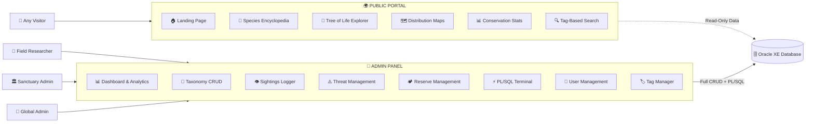

---

### 🌍 Component 1 — Public Portal (General View)

The **Public Portal** is the outward-facing side of the website, accessible to **any visitor without login**. It serves as a living encyclopedia and conservation awareness platform, presenting biodiversity data in a visually rich, read-only format.

#### Who Can Access
- **Anyone** — No authentication required. Open to students, researchers, educators, and the general public.

#### Pages & Features

| Page | Description | Data Source Tables |
|:---|:---|:---|
| **🏠 Landing Page** | Hero section with key conservation stats (total species, endangered counts, active reserves, ongoing threats), featured species highlights, and a call-to-action to explore the encyclopedia. | `Organisms`, `Species_Profiles`, `Conservation_Statuses`, `Conservation_Reserves`, `Regional_Threat_Logs` |
| **📖 Species Encyclopedia** | A searchable, filterable grid of species cards showing images, common/scientific names, conservation status badges, and diet types. Clicking a card navigates to the detailed profile page. | `Organisms`, `Species_Profiles`, `Species_Encyclopedia`, `Conservation_Statuses` |
| **🐾 Species Profile Page** | A dedicated, detailed profile page for each animal or plant storing physiological measurements, detailed habitat behavior descriptions, native ranges, geographical distribution details, food web interactions, and a dynamic photo gallery with multiple images and captions. | `Organisms`, `Species_Profiles`, `Species_Encyclopedia`, `Species_Photos`, `Conservation_Statuses`, `Species_Distribution`, `Ecological_Interactions` |
| **🌳 Tree of Life Explorer** | An interactive, expandable tree visualization of the full taxonomic hierarchy (Kingdom → Phylum → Class → Order → Family → Genus → Species). Users can drill into branches and view species counts per node. | `Taxonomic_Ranks`, `Organisms` (recursive self-join via `Parent_ID`) |
| **🗺️ Distribution Maps** | Regional species distribution data showing which species are found in which geographic regions, along with estimated populations and population trends. Organized by biome. | `Biomes`, `Geographical_Regions`, `Species_Distribution` |
| **📊 Conservation Dashboard** | Public-facing statistics: extinction risk leaderboard, reserve health summaries, ecological interaction counts, and species population trends — all rendered as visual cards and charts. | `V_ExtinctionRisk_Leaderboard`, `V_Reserve_HealthAnalytics`, `FN_Population_Density`, `FN_Ecosystem_Stability` |
| **🔍 Tag-Based Search** | Multi-tag AND-logic filtering (e.g., "Nocturnal" + "Apex Predator" + "Endangered") to discover species matching all selected traits. Uses `HAVING COUNT(DISTINCT Tag_Name) = N` query pattern. | `Tags`, `Organism_Tags`, `Organisms` |

#### Key Characteristics
- ✅ **No login required** — fully public and open
- ✅ **Read-only** — no database writes, only SELECT queries
- ✅ **SEO-friendly** — descriptive titles, meta tags, semantic HTML
- ✅ **Educational focus** — designed for learning and conservation awareness
- ✅ **Responsive** — works on desktop, tablet, and mobile

---

### 🔐 Component 2 — Admin Panel (Role-Based Control Center)

The **Admin Panel** is the internal, authenticated side of the website, accessible **only after login**. It is the operational hub where field researchers log data, sanctuary administrators manage reserves, and global administrators oversee the entire ecosystem.

#### Who Can Access

| Role | Access Level | Capabilities |
|:---|:---|:---|
| **🔬 Field Researcher** | Standard | Log sightings, submit threat reports, apply tags, view analytics, run read-only queries |
| **🏛️ Sanctuary Admin** | Elevated | All Field Researcher capabilities + manage reserves, update threat statuses, manage living specimens |
| **👑 Global Admin** | Full | All capabilities + taxonomy CRUD, user management, role assignments, database seeding, PL/SQL terminal access |

#### Pages & Features

| Page | Description | Available To | Data Source Tables |
|:---|:---|:---|:---|
| **📊 Dashboard** | Real-time analytics: total species, endangered counts, active threats, sighting heatmaps, extinction risk leaderboard, and reserve health metrics. Stat cards with SVG visuals. | All Roles | `V_ExtinctionRisk_Leaderboard`, `V_Reserve_HealthAnalytics`, aggregate queries |
| **🌳 Taxonomy Manager** | Full CRUD operations on the Tree of Life. Add, edit, and delete taxonomic nodes (Kingdom through Species). Manage species profiles, encyclopedia entries, conservation statuses, and upload/manage animal photos in the gallery. | Global Admin (CRUD), Others (Read) | `Taxonomic_Ranks`, `Organisms`, `Species_Profiles`, `Species_Encyclopedia`, `Species_Photos`, `Conservation_Statuses` |
| **👁️ Sightings Logger** | Form-based interface to log field observations: select species, reserve, quantity, health status, and notes. Trigger validation errors surface in UI toast notifications (e.g., `TRG_Sighting_Validator` blocks invalid records). | Field Researcher, Sanctuary Admin, Global Admin | `Sighting_Logs`, `Organisms`, `Conservation_Reserves`, `System_Users` |
| **⚠️ Threat Reports** | Submit new environmental threat assessments against geographic regions. Update resolution status (Active → Monitoring → Resolved). View threat severity timelines. | All Roles (Submit), Sanctuary Admin & Global Admin (Update) | `Regional_Threat_Logs`, `Threat_Types`, `Geographical_Regions`, `System_Users` |
| **🏕️ Reserve Management** | Monitor conservation reserves: budgets, areas, established dates, reserve types. View reserve health analytics from `V_Reserve_HealthAnalytics`. Manage ex-situ living specimens across research facilities. | Sanctuary Admin, Global Admin | `Conservation_Reserves`, `Research_Facilities`, `Living_Specimens`, `Geographical_Regions` |
| **⚡ PL/SQL Terminal** | Execute stored procedures and functions with live `DBMS_OUTPUT` capture displayed in a terminal-style console. Run `PRC_TrophicCascade_RiskReport`, `PRC_ConservationGrant_Allocate`, `FN_Population_Density`, `FN_Ecosystem_Stability`. | Global Admin | All PL/SQL objects |
| **👥 User Management** | Register new users, assign roles (Field Researcher, Sanctuary Admin, Global Admin), view user cards with affiliation and email details. User Switcher dropdown enables instant role switching for demo/testing. | Global Admin (Full), Others (View) | `System_Users` |
| **🏷️ Tag Manager** | Create and assign descriptive tags (Nocturnal, Venomous, Migratory, etc.) to organisms. Manage tag categories and color codes. | All Roles | `Tags`, `Organism_Tags`, `Organisms` |

#### Key Characteristics
- 🔒 **Authentication required** — login with username/password
- 🛡️ **Role-based access** — actions are restricted by user role
- ✏️ **Full CRUD** — create, read, update, delete operations on database tables
- 📡 **Live triggers** — database triggers surface validation errors in real-time
- 🖥️ **PL/SQL execution** — run stored procedures with `DBMS_OUTPUT` capture
- 🔄 **User Switcher** — instantly switch between user profiles to test role-based behavior

---

## Key System Features

### Module 1 — User Access & Role Management
* **Database Table:** `System_Users`
* **Role-Based Access Control (RBAC):** Three distinct access tiers (`Field Researcher`, `Sanctuary Admin`, `Global Admin`) enforced via CHECK constraints on user accounts.
* **Authentication and Security:** Login and registration pipeline checking for unique usernames and emails.
* **Affiliation Auditing:** Logs researchers' institutional affiliations (NGOs, universities, government bodies) for data accountability.
* **Observation Ownership:** Tags field sightings and environmental threat reports to the submitting researcher's profile.

### Module 2 — Biological Taxonomy Engine
* **Database Tables:** `Taxonomic_Ranks`, `Organisms`, `Conservation_Statuses`, `Species_Profiles`, `Species_Encyclopedia`, `Species_Photos`
* **Recursive Tree of Life:** Self-referencing tree topology mapping Kingdom → Phylum → Class → Order → Family → Genus → Species in a single table.
* **Hierarchical Node CRUD:** Global Admin actions to manage taxonomic categories. ON DELETE SET NULL protects child records.
* **Kingdom Separation:** CHECK constraints validating animal vs plant profiles.
* **Red List Status Tracking:** IUCN status monitoring per species (Least Concern to Extinct).
* **Species Profiles & Encyclopedia:** Narrative entries (using Oracle CLOB blocks), diet configs, lifespans, weights, metabolic indices, and representative image.
* **Multi-Photo Animal Profile Pages:** A dedicated profile page per species showing physical data, range info, ecological relationships, and a dynamic photo gallery populated via `Species_Photos`.

### Module 3 — Biogeography & Population Tracking
* **Database Tables:** `Biomes`, `Geographical_Regions`, `Species_Distribution`
* **Biome Classification:** Climate profile logging (annual rainfall, temperature, climate zones) for major ecosystems (rainforest, wetland, reef, tundra).
* **Regional Territories:** Geographical reserve borders, country locations, biomes, and protection statuses.
* **Species Distribution Bridges:** Tracks local population counts, survey timestamps, and population trends.
* **Geographical Anomaly Prevention:** Integrity constraints block impossible geographic assignments.

### Module 4 — Ecological Interaction Matrix
* **Database Tables:** `Interaction_Types`, `Ecological_Interactions`
* **Food Web Mapping:** Models mutualism, predation, competition, pollination, parasitism, and herbivory between species.
* **Impact Scale Analysis:** Impact scale score (-5 to +5) per interaction to weigh ecosystem value.
* **Self-Interaction Blockers:** Table constraints preventing self-referencing interactions.
* **Cross-Kingdom Triggers:** Triggers validate biological logic (e.g. blocking pollination between two animals).

### Module 5 — Conservation Reserves & Field Operations
* **Database Tables:** `Conservation_Reserves`, `Sighting_Logs`, `Research_Facilities`, `Living_Specimens`
* **Sanctuary Infrastructure:** Budget, area size, establishment year, and reserve type tracking.
* **Sighting Transaction Logs:** Field sighting records capturing quantity, health status (Healthy, Injured, Dead), and observer.
* **Sighting Validator Triggers:** Database triggers block impossible records (e.g. quantity <= 0 or null health status).
* **Ex-situ Specimen Inventory:** Captive wildlife registry tracking Zoo, Botanical Garden, and Seed Bank capacities and acquisition origins.
* **Auto-Extinction Triggers:** Triggers change a species status to "Extinct in the Wild" (EW) when its global population count hits zero.

### Module 6 — Threat Analysis & Mission Coordination
* **Database Tables:** `Threat_Types`, `Regional_Threat_Logs`
* **Environmental Registry:** Monitors deforestation, poaching, climate shift, and urban encroachment.
* **Threat Lifecycle Tracking:** Threat states (`Active`, `Monitoring`, `Resolved`) with severity levels (`Low` to `Critical`).
* **Fund Allocation Procedures:** PL/SQL procedures using cursors to proportionally distribute donation grants to underfunded reserves.

### Module 7 — Stored Automations & Analytical Views
* **Analytical Views & PL/SQL Blocks:** `V_ExtinctionRisk_Leaderboard`, `V_Reserve_HealthAnalytics`, `PRC_TrophicCascade_RiskReport`, `PRC_ConservationGrant_Allocate`, `FN_Population_Density`, `FN_Ecosystem_Stability`
* **Trophic Cascade Simulator:** Stored procedure running recursive food chain risk assessments per region, identifying apex predators with endangered prey.
* **Population Density Function:** Calculates species density (individuals per sq km) inside reserves.
* **Ecosystem Stability Calculator:** Computes a stability percentage based on positive vs negative interaction scores.
* **Extinction Leaderboard View:** Aggregates status levels, threat logs, and populations to rank at-risk species.
* **Reserve Health View:** Live health analytics summing sighting states (injured vs healthy) and budget efficiency.

### Module 8 — Search, Tag System & Advanced Queries
* **Database Tables:** `Tags`, `Organism_Tags`
* **Lineage Resolver Query:** Recursive self-join queries tracing a species' lineage up to Kingdom.
* **Keystone Species Finder:** Relational query using HAVING logic to find critical species with small populations.
* **AND-Logic Tag Filtering:** Multi-tag query (`HAVING COUNT(DISTINCT t.Tag_Name) = N`) to search species matching *all* checked behaviors (e.g. "Nocturnal" AND "Venomous" AND "Apex Predator").

---

## Entity Relationship (ER) Diagram


View Raw Diagram Code

View Raw Diagram Code

View Raw Diagram Code

```mermaid
erDiagram
    System_Users {
        NUMBER User_ID PK
        VARCHAR2 Username "UNIQUE"
        VARCHAR2 Password_Hash
        VARCHAR2 First_Name
        VARCHAR2 Last_Name
        VARCHAR2 Email "UNIQUE"
        VARCHAR2 Role_Name
        VARCHAR2 Affiliation
        DATE Created_At
    }

    Taxonomic_Ranks {
        NUMBER Rank_ID PK
        VARCHAR2 Rank_Name "UNIQUE"
        NUMBER Rank_Level
    }

    Organisms {
        NUMBER Organism_ID PK
        VARCHAR2 Scientific_Name "UNIQUE"
        VARCHAR2 Common_Name
        NUMBER Rank_ID FK
        NUMBER Parent_ID FK
        NUMBER Discovery_Year
    }

    Conservation_Statuses {
        VARCHAR2 Status_Code PK
        VARCHAR2 Status_Name "UNIQUE"
        NUMBER Risk_Level
    }

    Species_Profiles {
        NUMBER Profile_ID PK
        NUMBER Organism_ID FK
        VARCHAR2 Kingdom_Type
        VARCHAR2 Status_Code FK
        NUMBER Avg_Lifespan_Years
        NUMBER Avg_Weight_Kg
        VARCHAR2 Metabolic_Rate_Index
        VARCHAR2 Photosynthetic_Rate
    }

    Species_Encyclopedia {
        NUMBER Encyclopedia_ID PK
        NUMBER Organism_ID FK
        CLOB Description
        VARCHAR2 Diet_Type
        VARCHAR2 Diet_Details
        VARCHAR2 Physical_Description
        NUMBER Avg_Height_Cm
        NUMBER Avg_Length_Cm
        VARCHAR2 Habitat_Behavior
        VARCHAR2 Reproduction_Info
        VARCHAR2 Native_Range_Description
        VARCHAR2 Image_URL
        VARCHAR2 Fun_Fact
        DATE Last_Updated
    }

    Species_Photos {
        NUMBER Photo_ID PK
        NUMBER Organism_ID FK
        VARCHAR2 Photo_URL
        VARCHAR2 Caption
        CHAR Is_Primary
        DATE Uploaded_At
    }

    Biomes {
        NUMBER Biome_ID PK
        VARCHAR2 Biome_Name "UNIQUE"
        NUMBER Avg_Temperature_C
        NUMBER Avg_Rainfall_mm
        VARCHAR2 Climate_Zone
    }

    Geographical_Regions {
        NUMBER Region_ID PK
        VARCHAR2 Region_Name
        VARCHAR2 Country
        NUMBER Biome_ID FK
        NUMBER Area_SqKm
        CHAR Is_Protected
    }

    Species_Distribution {
        NUMBER Organism_ID FK
        NUMBER Region_ID FK
        NUMBER Estimated_Local_Population
        DATE Last_Survey_Date
        VARCHAR2 Population_Trend
    }

    Interaction_Types {
        NUMBER Type_ID PK
        VARCHAR2 Interaction_Name "UNIQUE"
        VARCHAR2 Description
    }

    Ecological_Interactions {
        NUMBER Interaction_ID PK
        NUMBER Organism_A_ID FK
        NUMBER Organism_B_ID FK
        NUMBER Type_ID FK
        NUMBER Ecological_Impact_Scale
        VARCHAR2 Interaction_Notes
    }

    Conservation_Reserves {
        NUMBER Reserve_ID PK
        VARCHAR2 Reserve_Name
        NUMBER Region_ID FK
        NUMBER Total_Area_SqKm
        NUMBER Annual_Budget_USD
        NUMBER Established_Year
        VARCHAR2 Reserve_Type
    }

    Sighting_Logs {
        NUMBER Sighting_ID PK
        NUMBER Organism_ID FK
        NUMBER Reserve_ID FK
        NUMBER User_ID FK
        TIMESTAMP Sighting_Timestamp
        NUMBER Quantity_Observed
        VARCHAR2 Health_Status
        VARCHAR2 Observation_Notes
    }

    Research_Facilities {
        NUMBER Facility_ID PK
        VARCHAR2 Facility_Name
        VARCHAR2 Facility_Type
        VARCHAR2 Country
        NUMBER Established_Year
        NUMBER Capacity
    }

    Living_Specimens {
        NUMBER Specimen_ID PK
        NUMBER Organism_ID FK
        NUMBER Facility_ID FK
        DATE Acquisition_Date
        VARCHAR2 Current_Condition
        NUMBER Origin_Region_ID FK
    }

    Threat_Types {
        NUMBER Threat_ID PK
        VARCHAR2 Threat_Name "UNIQUE"
        VARCHAR2 Threat_Category
    }

    Regional_Threat_Logs {
        NUMBER Log_ID PK
        NUMBER Region_ID FK
        NUMBER Threat_ID FK
        VARCHAR2 Severity_Level
        DATE Assessment_Date
        NUMBER Reported_By FK
        VARCHAR2 Resolution_Status
    }

    Tags {
        NUMBER Tag_ID PK
        VARCHAR2 Tag_Name "UNIQUE"
        VARCHAR2 Tag_Category
        VARCHAR2 Tag_Color
        NUMBER Created_By FK
    }

    Organism_Tags {
        NUMBER Organism_ID FK
        NUMBER Tag_ID FK
        NUMBER Tagged_By FK
        DATE Tagged_At
    }

    Organisms ||--o{ Organisms : "parent_of"
    Taxonomic_Ranks ||--o{ Organisms : "classifies"
    Organisms ||--|| Species_Profiles : "has_profile"
    Conservation_Statuses ||--o{ Species_Profiles : "states_status"
    Organisms ||--|| Species_Encyclopedia : "described_by"
    Organisms ||--o{ Species_Photos : "depicted_by"
    Biomes ||--o{ Geographical_Regions : "covers"
    Organisms ||--o{ Species_Distribution : "distributed_in"
    Geographical_Regions ||--o{ Species_Distribution : "contains"
    Organisms ||--o{ Ecological_Interactions : "acting_organism"
    Organisms ||--o{ Ecological_Interactions : "receiving_organism"
    Interaction_Types ||--o{ Ecological_Interactions : "defines"
    Geographical_Regions ||--o{ Conservation_Reserves : "houses"
    Organisms ||--o{ Sighting_Logs : "observed"
    Conservation_Reserves ||--o{ Sighting_Logs : "sighted_in"
    System_Users ||--o{ Sighting_Logs : "records"
    Research_Facilities ||--o{ Living_Specimens : "hosts"
    Organisms ||--o{ Living_Specimens : "kept_as"
    Geographical_Regions ||--o{ Living_Specimens : "originates_from"
    Geographical_Regions ||--o{ Regional_Threat_Logs : "threatens"
    Threat_Types ||--o{ Regional_Threat_Logs : "categorizes"
    System_Users ||--o{ Regional_Threat_Logs : "reports"
    System_Users ||--o{ Tags : "creates"
    Organisms ||--o{ Organism_Tags : "tagged_with"
    Tags ||--o{ Organism_Tags : "applies_to"
    System_Users ||--o{ Organism_Tags : "tags"
```

---

## Module-Specific Relationship Diagrams

This section details how key tables interact within each functional module, demonstrating specific self-references, 1-to-1 relationships, and many-to-many bridges.

### 1. Taxonomy Hierarchy (Self-Join)
The `Organisms` table references itself recursively via the `Parent_ID` foreign key to trace taxonomic hierarchy from Kingdom down to Species. It is categorized by static levels in `Taxonomic_Ranks`.


View Raw Diagram Code

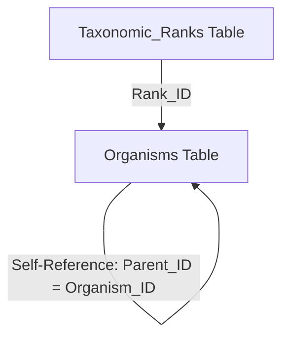

### 2. Species Details & Gallery Extensions
A species is registered in `Organisms` (with rank `Species`). Detailed biological characteristics and public encyclopedia data are stored in separate tables linked 1-to-1 using a `UNIQUE` foreign key, while a dedicated photo gallery table maps multiple images in a 1-to-Many relationship.


View Raw Diagram Code

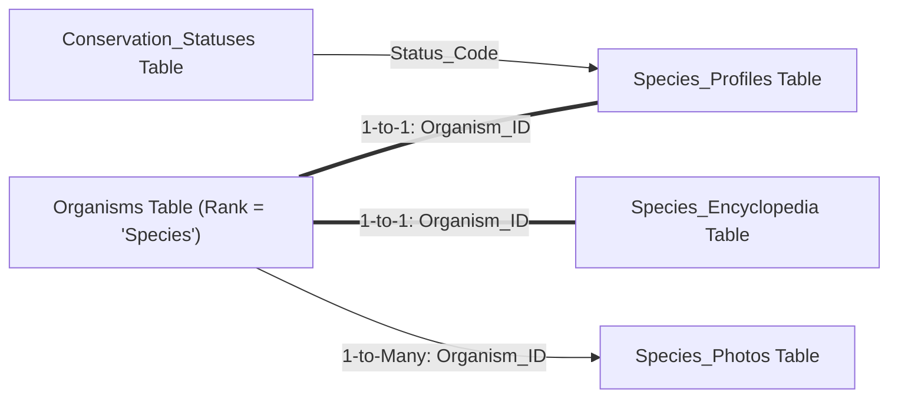

### 3. Biogeographical Distribution (Many-to-Many Bridge)
Organisms are mapped to different geographical regions in a many-to-many relationship using the `Species_Distribution` bridge table, which records estimated population sizes and trend vectors.


View Raw Diagram Code

View Raw Diagram Code

View Raw Diagram Code

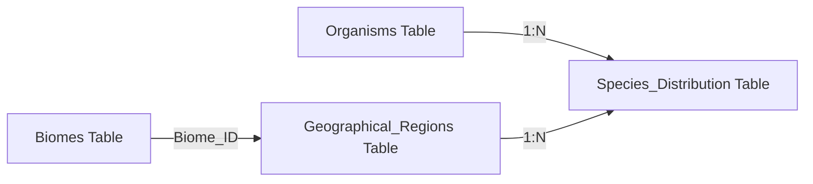

### 4. Ecological Interaction Matrix (Dual-FK Many-to-Many)
The food web network is represented in `Ecological_Interactions`, where both columns point to the `Organisms` table (representing acting organism A vs receiving organism B). A database constraint ensures no self-interaction occurs.


View Raw Diagram Code

View Raw Diagram Code

View Raw Diagram Code

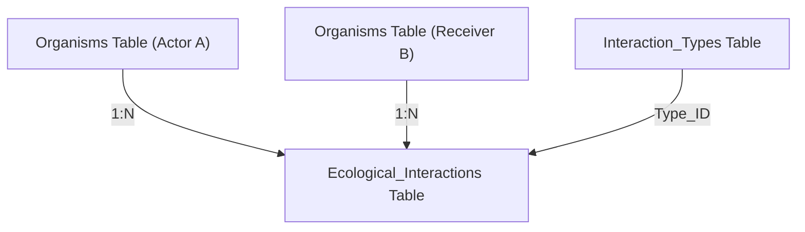

### 5. Field Operations & Sighting Logs (Transactions)
Field researchers record species observations in `Sighting_Logs`. This log operates as a high-frequency transaction table bridging the species, the specific reserve, and the submitting user.


View Raw Diagram Code

View Raw Diagram Code

View Raw Diagram Code

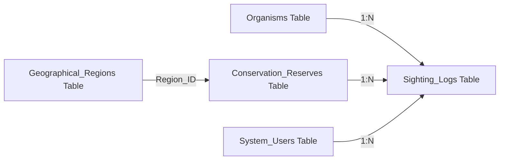

### 6. Threat Monitoring & Assessment
Environmental threats are logged against specific geographic regions in `Regional_Threat_Logs`, tracking severity, resolution, and reported users.


View Raw Diagram Code

View Raw Diagram Code

View Raw Diagram Code

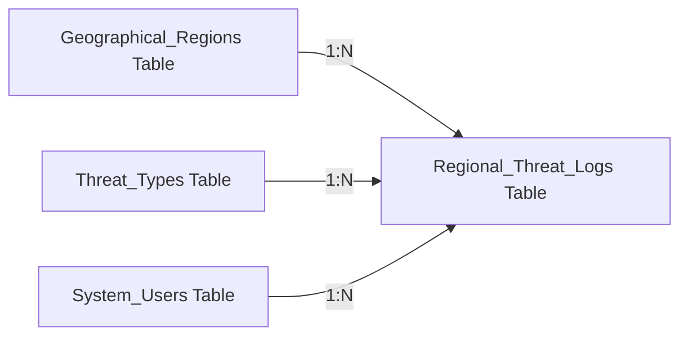

### 7. Organism Tagging System (Many-to-Many with Attribution)
Organisms are tagged with descriptive behaviors, attributes, or traits. The many-to-many bridge `Organism_Tags` logs both the tag and the researcher who applied it.


View Raw Diagram Code

View Raw Diagram Code

View Raw Diagram Code

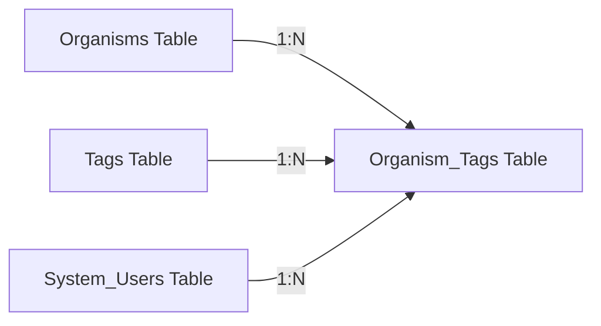

---

## Module 1 — User Access & Role Management

### 1. System_Users
Stores user credentials and roles.

| Column Name | Data Type | Key | Description / Constraints |
| :--- | :--- | :--- | :--- |
| **User_ID** | NUMBER | PK | Generated always as identity |
| **Username** | VARCHAR2(50) | UNIQUE | NOT NULL — login handle |
| **Password_Hash** | VARCHAR2(255) | | NOT NULL — secure hashed password |
| **First_Name** | VARCHAR2(50) | | NOT NULL |
| **Last_Name** | VARCHAR2(50) | | NOT NULL |
| **Email** | VARCHAR2(100) | UNIQUE | NOT NULL |
| **Role_Name** | VARCHAR2(30) | CHECK | NOT NULL — CHECK IN ('Field Researcher','Sanctuary Admin','Global Admin') |
| **Affiliation** | VARCHAR2(100) | | University, NGO, or institute affiliation |
| **Created_At** | DATE | | DEFAULT SYSDATE |

---

## Module 2 — Biological Taxonomy Engine

### 2. Taxonomic_Ranks
Lookup table for hierarchical ranks.

| Column Name | Data Type | Key | Description / Constraints |
| :--- | :--- | :--- | :--- |
| **Rank_ID** | NUMBER | PK | Generated always as identity |
| **Rank_Name** | VARCHAR2(30) | UNIQUE | NOT NULL — Kingdom, Phylum, Class, Order, Family, Genus, Species |
| **Rank_Level** | NUMBER(1) | | 1 = Kingdom, 7 = Species |

### 3. Organisms (Recursive Tree)
Self-referential table mapping the taxonomic tree.

| Column Name | Data Type | Key | Description / Constraints |
| :--- | :--- | :--- | :--- |
| **Organism_ID** | NUMBER | PK | Generated always as identity |
| **Scientific_Name** | VARCHAR2(100) | UNIQUE | NOT NULL — Latin name |
| **Common_Name** | VARCHAR2(100) | | Nullable everyday name |
| **Rank_ID** | NUMBER | FK | References Taxonomic_Ranks(Rank_ID) |
| **Parent_ID** | NUMBER | FK | References Organisms(Organism_ID) ON DELETE SET NULL |
| **Discovery_Year** | NUMBER(4) | | Classification year |

### 4. Conservation_Statuses
IUCN status lookup table.

| Column Name | Data Type | Key | Description / Constraints |
| :--- | :--- | :--- | :--- |
| **Status_Code** | VARCHAR2(3) | PK | LC, NT, VU, EN, CR, EW, EX |
| **Status_Name** | VARCHAR2(50) | UNIQUE | NOT NULL — e.g., Critically Endangered |
| **Risk_Level** | NUMBER(1) | | 1 = Least Concern, 7 = Extinct |

### 5. Species_Profiles
Scientific measurement details. Enforces 1-to-1 relationship with Organisms.

| Column Name | Data Type | Key | Description / Constraints |
| :--- | :--- | :--- | :--- |
| **Profile_ID** | NUMBER | PK | Generated always as identity |
| **Organism_ID** | NUMBER | FK, UNIQUE | References Organisms(Organism_ID) ON DELETE CASCADE |
| **Kingdom_Type** | VARCHAR2(10) | CHECK | NOT NULL — CHECK IN ('Animal', 'Plant') |
| **Status_Code** | VARCHAR2(3) | FK | References Conservation_Statuses(Status_Code) |
| **Avg_Lifespan_Years** | NUMBER(6,2) | | Nullable |
| **Avg_Weight_Kg** | NUMBER(8,2) | | Nullable |
| **Metabolic_Rate_Index** | VARCHAR2(50) | | Nullable (for animals) |
| **Photosynthetic_Rate** | VARCHAR2(50) | | Nullable (for plants) |

### 6. Species_Encyclopedia
Public-facing narrative content. Enforces 1-to-1 relationship with Organisms.

| Column Name | Data Type | Key | Description / Constraints |
| :--- | :--- | :--- | :--- |
| **Encyclopedia_ID** | NUMBER | PK | Generated always as identity |
| **Organism_ID** | NUMBER | FK, UNIQUE | References Organisms(Organism_ID) ON DELETE CASCADE |
| **Description** | CLOB | | Narrative details |
| **Diet_Type** | VARCHAR2(20) | CHECK | CHECK IN ('Carnivore','Herbivore','Omnivore','Detritivore','Autotroph') |
| **Diet_Details** | VARCHAR2(300) | | Narrative details about diet |
| **Physical_Description** | VARCHAR2(500) | | Markings, colors, sizes |
| **Avg_Height_Cm** | NUMBER(6,2) | | Nullable |
| **Avg_Length_Cm** | NUMBER(6,2) | | Nullable |
| **Habitat_Behavior** | VARCHAR2(500) | | Behaviors (nocturnal, territorial) |
| **Reproduction_Info** | VARCHAR2(300) | | Gestation, breeding season |
| **Native_Range_Description**| VARCHAR2(300) | | Geographic range text |
| **Image_URL** | VARCHAR2(500) | | Link to representative image |
| **Fun_Fact** | VARCHAR2(300) | | Trivia details |
| **Last_Updated** | DATE | | DEFAULT SYSDATE |

### 7. Species_Photos
Animal Photo Gallery. Enforces 1-to-many relationship with Organisms to allow multiple photos for each animal profile.

| Column Name | Data Type | Key | Description / Constraints |
| :--- | :--- | :--- | :--- |
| **Photo_ID** | NUMBER | PK | Generated always as identity |
| **Organism_ID** | NUMBER | FK | References Organisms(Organism_ID) ON DELETE CASCADE |
| **Photo_URL** | VARCHAR2(500) | | NOT NULL — Link to photo file / storage |
| **Caption** | VARCHAR2(200) | | Nullable caption describing the photo |
| **Is_Primary** | CHAR(1) | CHECK | CHECK IN ('Y','N') DEFAULT 'N' — Y for the primary profile display picture |
| **Uploaded_At** | DATE | | DEFAULT SYSDATE |

---

## Module 3 — Biogeography & Population Tracking

### 8. Biomes
Lookup table for biomes.

| Column Name | Data Type | Key | Description / Constraints |
| :--- | :--- | :--- | :--- |
| **Biome_ID** | NUMBER | PK | Generated always as identity |
| **Biome_Name** | VARCHAR2(50) | UNIQUE | NOT NULL — e.g. Rainforest, Desert |
| **Avg_Temperature_C** | NUMBER(5,2) | | Nullable |
| **Avg_Rainfall_mm** | NUMBER(6,1) | | Nullable |
| **Climate_Zone** | VARCHAR2(30) | | Tropical, Temperate, Polar |

### 9. Geographical_Regions
Named conservation regions.

| Column Name | Data Type | Key | Description / Constraints |
| :--- | :--- | :--- | :--- |
| **Region_ID** | NUMBER | PK | Generated always as identity |
| **Region_Name** | VARCHAR2(100) | | NOT NULL |
| **Country** | VARCHAR2(100) | | NOT NULL |
| **Biome_ID** | NUMBER | FK | References Biomes(Biome_ID) |
| **Area_SqKm** | NUMBER(12,2) | | Total square kilometers |
| **Is_Protected** | CHAR(1) | CHECK | CHECK IN ('Y','N') |

### 10. Species_Distribution
Bridge table representing many-to-many relationship of species in regions.

| Column Name | Data Type | Key | Description / Constraints |
| :--- | :--- | :--- | :--- |
| **Organism_ID** | NUMBER | CPK, FK | References Organisms(Organism_ID) ON DELETE CASCADE |
| **Region_ID** | NUMBER | CPK, FK | References Geographical_Regions(Region_ID) ON DELETE CASCADE |
| **Estimated_Local_Population**| NUMBER(10) | CHECK | CHECK >= 0 |
| **Last_Survey_Date** | DATE | | Nullable |
| **Population_Trend** | VARCHAR2(15) | CHECK | CHECK IN ('Increasing','Stable','Decreasing','Unknown') |

---

## Module 4 — Ecological Interaction Matrix

### 11. Interaction_Types
Categories of species interactions.

| Column Name | Data Type | Key | Description / Constraints |
| :--- | :--- | :--- | :--- |
| **Type_ID** | NUMBER | PK | Generated always as identity |
| **Interaction_Name** | VARCHAR2(50) | UNIQUE | NOT NULL — Predation, Mutualism, Pollination, etc. |
| **Description** | VARCHAR2(200) | | Nullable description |

### 12. Ecological_Interactions
Interactions between species A and B.

| Column Name | Data Type | Key | Description / Constraints |
| :--- | :--- | :--- | :--- |
| **Interaction_ID** | NUMBER | PK | Generated always as identity |
| **Organism_A_ID** | NUMBER | FK | References Organisms(Organism_ID) ON DELETE CASCADE |
| **Organism_B_ID** | NUMBER | FK | References Organisms(Organism_ID) ON DELETE CASCADE |
| **Type_ID** | NUMBER | FK | References Interaction_Types(Type_ID) |
| **Ecological_Impact_Scale**| NUMBER(2) | CHECK | CHECK BETWEEN -5 AND 5 |
| **Interaction_Notes** | VARCHAR2(300) | | Observation logs |
| **chk_no_self** | CONSTRAINT | CHECK | Organism_A_ID <> Organism_B_ID |

---

## Module 5 — Conservation Reserves & Field Operations

### 13. Conservation_Reserves
Reserve information.

| Column Name | Data Type | Key | Description / Constraints |
| :--- | :--- | :--- | :--- |
| **Reserve_ID** | NUMBER | PK | Generated always as identity |
| **Reserve_Name** | VARCHAR2(100) | | NOT NULL |
| **Region_ID** | NUMBER | FK | References Geographical_Regions(Region_ID) |
| **Total_Area_SqKm** | NUMBER(10,2) | CHECK | CHECK > 0 |
| **Annual_Budget_USD** | NUMBER(14,2) | CHECK | CHECK >= 0 |
| **Established_Year** | NUMBER(4) | | Nullable |
| **Reserve_Type** | VARCHAR2(30) | | National Park, Wildlife Sanctuary, etc. |

### 14. Sighting_Logs
High frequency field sightings database.

| Column Name | Data Type | Key | Description / Constraints |
| :--- | :--- | :--- | :--- |
| **Sighting_ID** | NUMBER | PK | Generated always as identity |
| **Organism_ID** | NUMBER | FK | References Organisms(Organism_ID) ON DELETE CASCADE |
| **Reserve_ID** | NUMBER | FK | References Conservation_Reserves(Reserve_ID) ON DELETE CASCADE |
| **User_ID** | NUMBER | FK | References System_Users(User_ID) |
| **Sighting_Timestamp** | TIMESTAMP | | DEFAULT SYSTIMESTAMP NOT NULL |
| **Quantity_Observed** | NUMBER(6) | CHECK | CHECK > 0 |
| **Health_Status** | VARCHAR2(20) | CHECK | CHECK IN ('Healthy','Injured','Malnourished','Dead','Unknown') |
| **Observation_Notes** | VARCHAR2(500) | | Field notes |

### 15. Research_Facilities
Ex-situ conservation facilities.

| Column Name | Data Type | Key | Description / Constraints |
| :--- | :--- | :--- | :--- |
| **Facility_ID** | NUMBER | PK | Generated always as identity |
| **Facility_Name** | VARCHAR2(100) | | NOT NULL |
| **Facility_Type** | VARCHAR2(30) | CHECK | CHECK IN ('Botanical Garden','Zoo','Seed Bank','Gene Bank','Aquarium') |
| **Country** | VARCHAR2(100) | | NOT NULL |
| **Established_Year** | NUMBER(4) | | Nullable |
| **Capacity** | NUMBER(6) | | Max capacity |

### 16. Living_Specimens
Captive organism specimens tracker.

| Column Name | Data Type | Key | Description / Constraints |
| :--- | :--- | :--- | :--- |
| **Specimen_ID** | NUMBER | PK | Generated always as identity |
| **Organism_ID** | NUMBER | FK | References Organisms(Organism_ID) ON DELETE CASCADE |
| **Facility_ID** | NUMBER | FK | References Research_Facilities(Facility_ID) |
| **Acquisition_Date** | DATE | | NOT NULL |
| **Current_Condition** | VARCHAR2(20) | CHECK | CHECK IN ('Healthy','Diseased','Propagating','Critical','Deceased') |
| **Origin_Region_ID** | NUMBER | FK | References Geographical_Regions(Region_ID) |

---

## Module 6 — Threat Analysis

### 17. Threat_Types
Lookup table for environmental threats.

| Column Name | Data Type | Key | Description / Constraints |
| :--- | :--- | :--- | :--- |
| **Threat_ID** | NUMBER | PK | Generated always as identity |
| **Threat_Name** | VARCHAR2(60) | UNIQUE | NOT NULL — e.g. Deforestation, Poaching |
| **Threat_Category** | VARCHAR2(30) | | Human-Caused, Natural, Climate-Related |

### 18. Regional_Threat_Logs
Assessed regional threats tracker.

| Column Name | Data Type | Key | Description / Constraints |
| :--- | :--- | :--- | :--- |
| **Log_ID** | NUMBER | PK | Generated always as identity |
| **Region_ID** | NUMBER | FK | References Geographical_Regions(Region_ID) |
| **Threat_ID** | NUMBER | FK | References Threat_Types(Threat_ID) |
| **Severity_Level** | VARCHAR2(10) | CHECK | CHECK IN ('Low','Medium','High','Critical') |
| **Assessment_Date** | DATE | | NOT NULL |
| **Reported_By** | NUMBER | FK | References System_Users(User_ID) |
| **Resolution_Status** | VARCHAR2(15) | CHECK | CHECK IN ('Active','Monitoring','Resolved') DEFAULT 'Active' |

---

## Module 7 — Tags System

### 19. Tags
Master list of tags.

| Column Name | Data Type | Key | Description / Constraints |
| :--- | :--- | :--- | :--- |
| **Tag_ID** | NUMBER | PK | Generated always as identity |
| **Tag_Name** | VARCHAR2(60) | UNIQUE | NOT NULL — e.g. Nocturnal, Venomous |
| **Tag_Category** | VARCHAR2(30) | | Behavior, Habitat, Diet, etc. |
| **Tag_Color** | VARCHAR2(10) | | Hex color code |
| **Created_By** | NUMBER | FK | References System_Users(User_ID) |

### 20. Organism_Tags
Bridge table mapping organisms to descriptive tags.

| Column Name | Data Type | Key | Description / Constraints |
| :--- | :--- | :--- | :--- |
| **Organism_ID** | NUMBER | CPK, FK | References Organisms(Organism_ID) ON DELETE CASCADE |
| **Tag_ID** | NUMBER | CPK, FK | References Tags(Tag_ID) ON DELETE CASCADE |
| **Tagged_By** | NUMBER | FK | References System_Users(User_ID) |
| **Tagged_At** | DATE | | DEFAULT SYSDATE |
