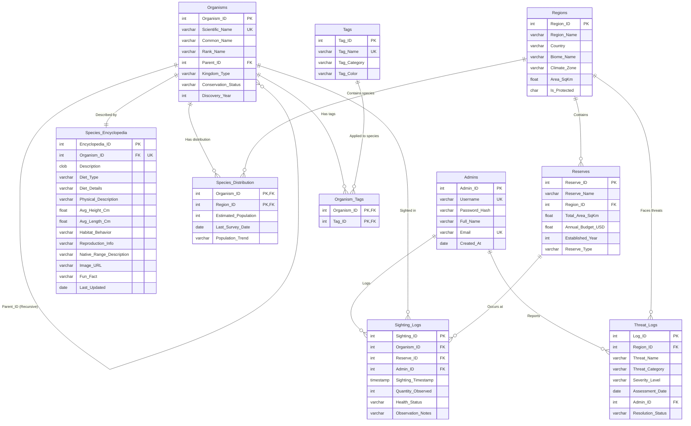

# Wildlife & Conservation Management System

This project is organized into modules for easier implementation. Please refer to the documentation in the \docs/\ directory:

## Documentation Modules

1. **[Project Proposal & Core Schema](docs/01_Project_Proposal.md)**: Overall concept, 9-table schema, PL/SQL requirements, and tech stack.
2. **[Page Specification](docs/02_Page_Specification.md)**: Complete UI/UX routes for Viewer and Admin portals.
3. **[Database Architecture](docs/03_Database_Architecture.md)**: Table relationships, ERD, and communication flow.
4. **[User Capabilities](docs/04_User_Capabilities.md)**: Detailed breakdown of what Public Visitors and Admins can do.
5. **[Complete Feature List](docs/05_Feature_List.md)**: 41-point feature checklist for public, admin, PL/SQL, analytics, and DB design.

## Implementation Plan
*To be determined (e.g., Database Setup -> Backend Setup -> Frontend Setup).*

## ER & Schema Diagram

