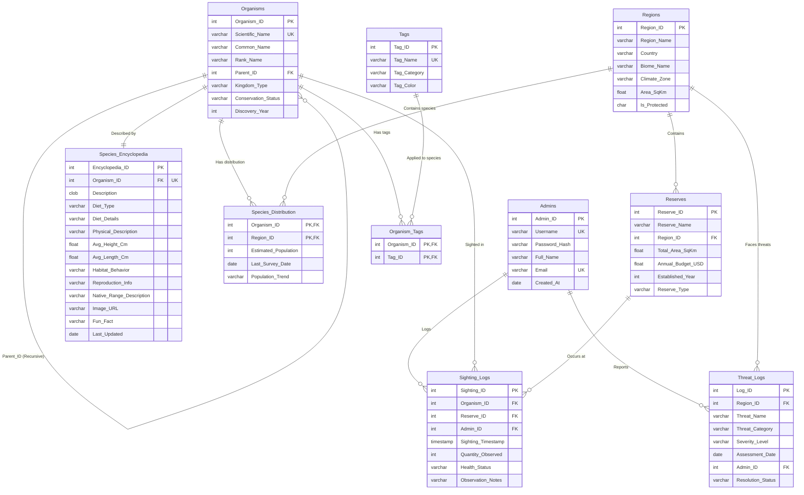

# Database Architecture — Table Relationships & Communication Flow

## The 9 Tables at a Glance

| # | Table | Type | Primary Key |
|---|---|---|---|
| 1 | Admins | Standalone | Admin_ID |
| 2 | Organisms | **Recursive hub** | Organism_ID |
| 3 | Species_Encyclopedia | 1:1 satellite | Encyclopedia_ID |
| 4 | Regions | Standalone | Region_ID |
| 5 | Species_Distribution | M:N bridge | (Organism_ID, Region_ID) |
| 6 | Reserves | Standalone | Reserve_ID |
| 7 | Sighting_Logs | Transaction | Sighting_ID |
| 8 | Threat_Logs | Transaction | Log_ID |
| 9 | Tags / Organism_Tags | M:N bridge | (Organism_ID, Tag_ID) |

---

## Full Relationship Map (ER & Schema Diagram)



---

## Table-by-Table: Who Talks to Whom

### 1. Admins → everything (as the actor, not the subject)
Admins doesn't get queried by other tables for *data* — it gets referenced as a **foreign key pointer** recording *who did what*.

- `Sighting_Logs.Admin_ID → Admins.Admin_ID` — every sighting log knows which admin submitted it
- `Threat_Logs.Admin_ID → Admins.Admin_ID` — every threat report knows which admin filed it
- `Tags.Created_By → Admins.Admin_ID` (optional) — tracks tag creator

**Communication pattern:** One-way reference. Admins never needs to look anything up from these tables for normal operation — only for audit queries like "show me everything Admin X has logged."

---

### 2. Organisms — the central hub (touches almost every other table)

**a) Self-referencing (recursive):**
```
Organisms.Parent_ID → Organisms.Organism_ID
```
This is the table talking to *itself*. Every row optionally points to another row in the same table as its parent. A Species row points to its Genus row, which points to its Family row, and so on up to a Kingdom row where `Parent_ID IS NULL`. This single relationship is what builds the entire taxonomy tree without needing 7 separate rank tables.

**b) One-to-one with Species_Encyclopedia:**
```
Species_Encyclopedia.Organism_ID → Organisms.Organism_ID  (UNIQUE)
```
Encyclopedia content is split into its own table rather than living as extra columns on Organisms, because it's edited by a different workflow (content writing vs. taxonomy classification) and updated at a different frequency. The UNIQUE constraint enforces exactly one encyclopedia entry per organism. When `Organisms` is queried for the public Species Detail page, it's almost always joined with `Species_Encyclopedia` in the same query.

**c) Many-to-many with Regions (via Species_Distribution):**
```
Species_Distribution.Organism_ID → Organisms.Organism_ID
Species_Distribution.Region_ID   → Regions.Region_ID
```
A species can live in many regions, and a region holds many species. Neither table can reference the other directly — `Species_Distribution` sits in between as the bridge, carrying its own extra data (population estimate, survey date, trend) on each connection.

**d) Many-to-many with Tags (via Organism_Tags):**
```
Organism_Tags.Organism_ID → Organisms.Organism_ID
Organism_Tags.Tag_ID      → Tags.Tag_ID
```
Same bridge pattern as Species_Distribution. This is what powers the public tag search — the bridge table is queried with a `HAVING COUNT(DISTINCT Tag_Name) = N` to find organisms matching *all* selected tags at once.

**e) One-to-many into Sighting_Logs:**
```
Sighting_Logs.Organism_ID → Organisms.Organism_ID
```
Every field sighting is tied to exactly one organism. One organism can have many sighting log entries over time.

---

### 3. Regions — the geographic anchor

```
Reserves.Region_ID              → Regions.Region_ID
Species_Distribution.Region_ID  → Regions.Region_ID
Threat_Logs.Region_ID           → Regions.Region_ID
```

Regions sits at the center of geography-related data. Three different tables point into it:
- **Reserves** — a protected area always belongs to exactly one region
- **Species_Distribution** — links which species live where
- **Threat_Logs** — every environmental threat is tied to a region

**Communication pattern:** Regions is a "lookup-and-join" table — it rarely changes after initial setup, but it's joined into almost every geographic or analytical query (e.g. "show all threats in regions where Tiger lives" requires joining Threat_Logs → Regions ← Species_Distribution → Organisms).

---

### 4. Reserves — operational hub for field data

```
Sighting_Logs.Reserve_ID → Reserves.Reserve_ID
Threat_Logs.Reserve_ID   → Reserves.Reserve_ID  (nullable — a threat can be region-wide, not reserve-specific)
```

Reserves connects upward to Regions (one region can have multiple reserves) and downward to Sighting_Logs (a reserve accumulates many sightings over time, which is what the `V_Reserve_Health` view aggregates).

---

### 5. Sighting_Logs — the busiest transaction table

This table has **three foreign keys**, making it the most heavily-connected transactional table:
```
Sighting_Logs.Organism_ID → Organisms.Organism_ID
Sighting_Logs.Reserve_ID  → Reserves.Reserve_ID
Sighting_Logs.Admin_ID    → Admins.Admin_ID
```

Every row says: *"On this timestamp, this admin observed this quantity of this organism at this reserve, in this health condition."* It's a pure fact table — high insert volume, rarely updated, frequently aggregated (counts, trends, health breakdowns).

This is also where the `TRG_Sighting_Validator` trigger lives — it fires on every INSERT to block bad data (zero quantity, missing health status) before the row is committed.

---

### 6. Threat_Logs — region-level risk tracking

```
Threat_Logs.Region_ID → Regions.Region_ID
Threat_Logs.Admin_ID  → Admins.Admin_ID
```

Simpler than Sighting_Logs — only two foreign keys. This is where `TRG_CriticalThreat_Alert` fires: an AFTER INSERT trigger that automatically creates a second alert row in the same table when severity is Critical, demonstrating a self-referential trigger pattern (the table writing back into itself).

---

## How a Single Page Load Triggers Multiple Table Joins

To make this concrete, here's what happens behind the scenes for two real pages:

### Species Detail page (`/species/:id`)
```sql
SELECT o.Common_Name, o.Scientific_Name, o.Conservation_Status,
       e.Description, e.Diet_Type, e.Habitat_Behavior, e.Fun_Fact
FROM   Organisms o
JOIN   Species_Encyclopedia e ON o.Organism_ID = e.Organism_ID
WHERE  o.Organism_ID = :id;
```
Then a second query for the distribution table:
```sql
SELECT r.Region_Name, r.Country, sd.Estimated_Population, sd.Population_Trend
FROM   Species_Distribution sd
JOIN   Regions r ON sd.Region_ID = r.Region_ID
WHERE  sd.Organism_ID = :id;
```
Then a recursive self-join for the taxonomy breadcrumb (Organisms joining to itself 6 times up the Parent_ID chain).

**Tables touched:** Organisms, Species_Encyclopedia, Species_Distribution, Regions — 4 tables for one page.

### Admin Dashboard (`/admin/dashboard`)
The `V_Reserve_Health` view alone joins:
```sql
Reserves ⟕ Regions ⟕ Sighting_Logs
```
And the `V_ExtinctionRisk` view joins:
```sql
Organisms ⟕ Species_Distribution
```
Plus the stat cards run separate aggregate queries against `Organisms` (for total/critical counts) and `Threat_Logs` (for active threat count).

**Tables touched:** Reserves, Regions, Sighting_Logs, Organisms, Species_Distribution, Threat_Logs — effectively all 9 tables feed into this one page across its various widgets.

---

## Summary — Why This Design Communicates Well

1. **Organisms is the gravitational center.** Five of the other eight tables reference it directly. This is intentional — taxonomy is the spine of the entire system, and everything else (encyclopedia content, distribution, sightings, tags) hangs off of it.

2. **Bridge tables exist only where a true many-to-many relationship is unavoidable** (Species_Distribution, Organism_Tags). Everywhere else, relationships were flattened into foreign keys or merged columns during the simplification pass.

3. **Admins is a pure audit reference** — three tables point to it, but it never needs to query outward. This keeps the user/role complexity minimal while still preserving accountability (every write operation is traceable to an admin).

4. **Regions and Reserves form a two-level geographic hierarchy** (Region → Reserve, one-to-many) that everything location-based hangs off of, avoiding the need to repeat country/biome data in multiple places.
